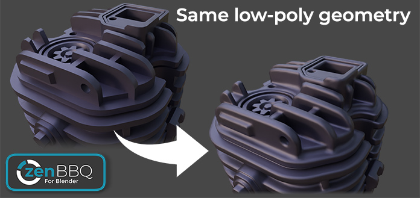
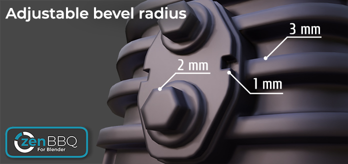
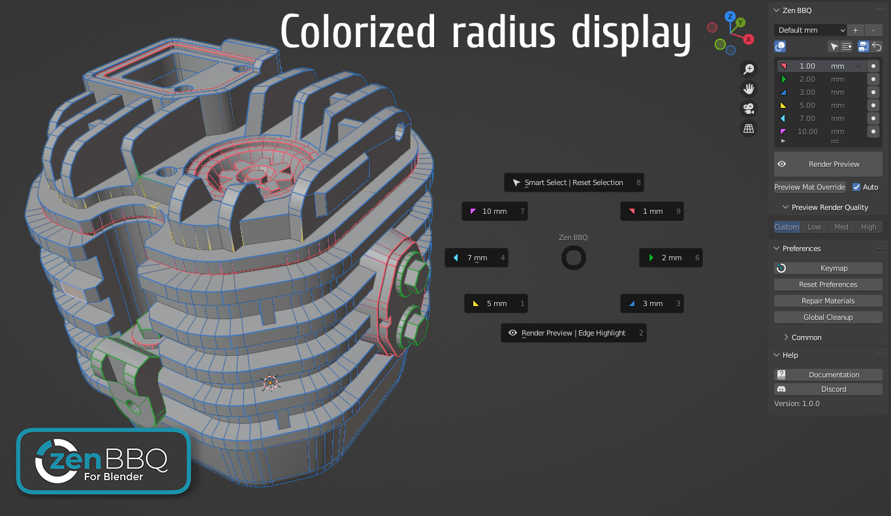
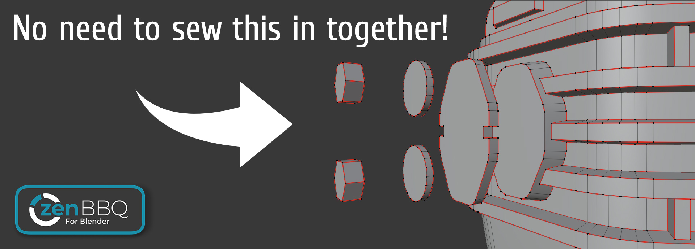

# Zen BBQ for Blender 2.0

## Quick Start

* [**Installation**](installation.md) — How to install Zen BBQ as a local Blender Extension.
* [**Quick Start Guide**](quickstart.md) — Your first steps from assigning to baking.
* [**Troubleshooting**](troubleshooting.md) — Solutions to common issues and pipeline questions.

---

## Introduction

**Zen BBQ** is a professional toolset for Blender designed to create, adjust, visualize, and bake non-destructive procedural bevels in a couple of clicks! 

Are you tired of preparing complex geometry, fighting shading issues, or sliding support loops for Subd or Bevel modifiers? Look no further!

### Application Areas

* **Visualization:** Bevels catch light highlights and help the eye define object shapes. Make your models look realistic and physically accurate without adding extra polygons to your geometry.
* **Concept Art & Booleans:** Design awesome hard-surface objects with ease. Just stick mesh elements into each other, use our *Live Boolean* integration, get smooth transitions, and create complex shapes on the fly.
* **Game Development:** Bake your procedural BBQ Bevels into clean Normal Maps for game-ready assets. Save hours of tedious high-poly modeling by skipping support loops entirely!

---

## Main Features

* **Complete Cycles Bevel Shader Control:** Set bevel values globally for the entire model or assign custom weights to individual Edges and Vertices.
* **Local Extension Architecture:** Fully compatible with **Blender 4.2 LTS** and newer, utilizing the modern Extension system for hassle-free offline installation.
* **Flexible Measurement Units:** Set and mix bevel radii in Millimeters (mm), Centimeters (cm), Meters (m), Inches (in), and more within a single list.
* **Custom Preset Groups:** Organize your most-used radii into custom groups and access them instantly.
* **Non-Destructive & Material Friendly:** Zen BBQ stores bevel values directly in native mesh attributes, seamlessly embedding them into your existing shader networks.
* **Smart Render Preview System:** Instantly toggle between **Material**, **Shader** (Cycles preview), and **Image** (Baked texture) viewport modes.
* **Viewport Color Overlay:** Visually distinguish assigned bevel sizes in the viewport using the customizable **Highlight Bevels** color scheme.
* **Intuitive UI:** Access everything you need via the clean **Sidebar (N-Panel)** or summon the quick-action **Pie Menu** via the global `Ctrl + Shift + X` hotkey.
* **Advanced Baking Pipeline:** Bake your bevels into Normal, Ambient Occlusion (AO), and Curvature maps directly inside Blender.

**Zen BBQ — Build Bevels Quickly!**

---

 

 

<!--  
 -->

---

## Support & Storefronts

Enjoying the Zen BBQ experience? Stay connected or get support via our official channels:

[ **Gumroad**](https://sergeytyapkin.gumroad.com/l/zenbbq) | [ **BlenderMarket**](https://blendermarket.com/products/zen-bbq) | [ **Discord**](https://discord.gg/wGpFeME)
