# Quick Guide How to Bake Normal Map

## Prepare UVs

First, make sure that you have UVs good for baking normal maps. This tutor is not about making UVs (it would require a separate book), so we assume that the reader is already familiar with this theme. In short: 
UV shells should have enough margins. 
Hard edges should be separated on UV. 

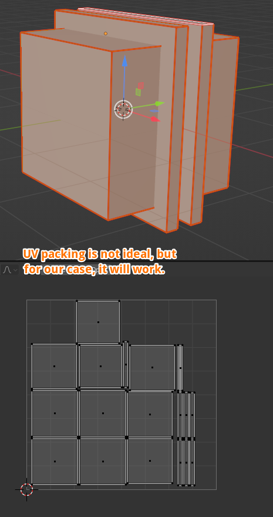

*Example of mesh with UVs ready for baking.*

## Add image node to the object's material

Make sure that you have your mesh selected. 

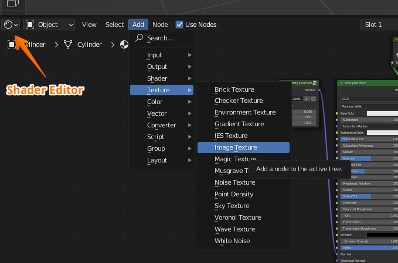

In Shader Editor, choose **Add --- Texture --- Image Texture** 

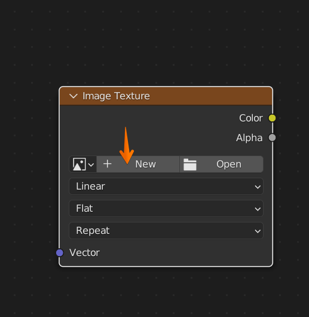

In that node, click **New**

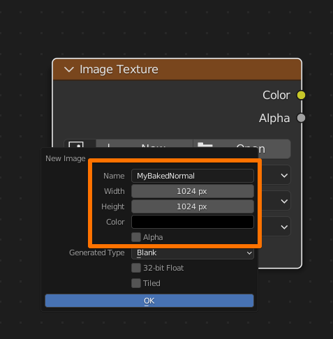

In this window, choose the **Name** of your map, **Width** and **Height**. 
**Alpha** is not needed for Normal Map, so we can turn it off. 
After that, click OK

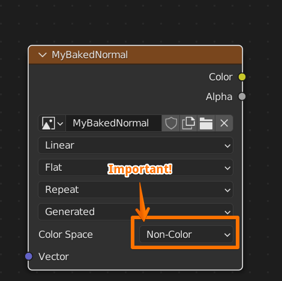

It's very important to set **Color Space** to **Non-Color**. Now we're done with the image.

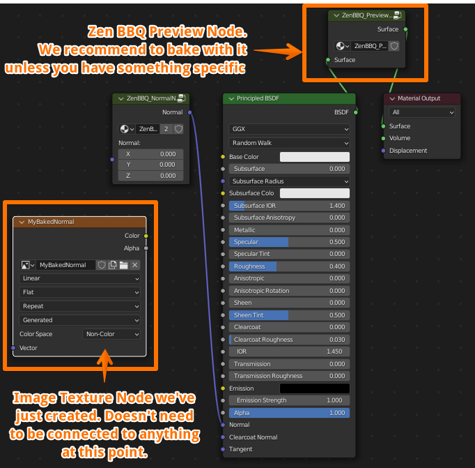

Final shader looks like this. You don't need to connect the image node anywhere right now. 
We recommend to bake with the Preview Node on. If it's not present in your material, you can add it by using [**Preview Mat Override**](npanel.md#2-preview-material-override-toggle) button in Zen BBQ N-Panel.

## Baking Settings

Make sure you have your object selected. 

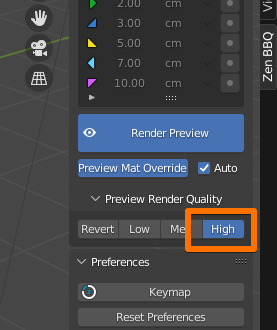

Make sure you have Quality setting in the N-Panel set to High.
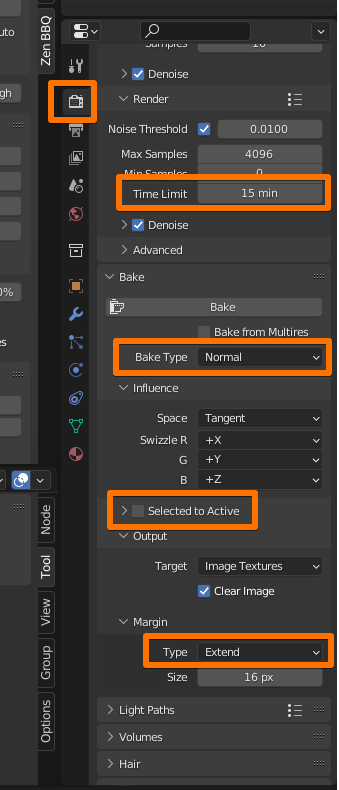

In **Render Properties** Tab: 
In **Bake Accordion** change:

- **Bake Type**: Normal
- **Selected to Active**: Off
- **Margin Type**: Extend

In **Render Accordion** I prefer to choose **Time Limit**, for example, 15 minutes. The more time you set, the better quality you will get. 5-15 minutes are OK to render a draft variant. Of course, it depends on your computer's power, image resolution, mesh complexity, et cetera.

## Bake

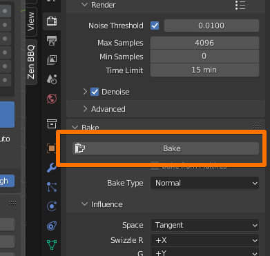

When you're set, click **Bake** and wait till it's done.

## Viewing the result

In **Shader Editor**:

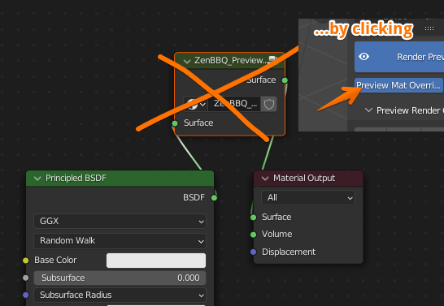

- Remove the Preview Node (Manually or by using [**Preview Mat Override**](npanel.md#2-preview-material-override-toggle) button in Zen BBQ N-Panel.

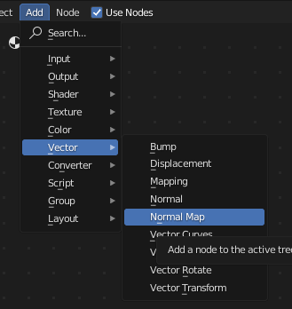

- Add a Normal Map node

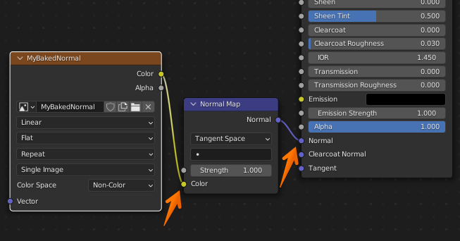

- Connect output of it to Normal input of your surface, and your Image Node Color output to the Color input of the Normal Map node.

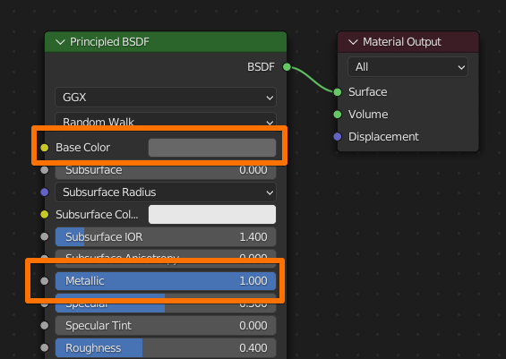

- We're mostly done. Now adjust your material if you want to. I set somewhat grey-ish **Base Color** and **Metallic** to 1 for better viewing the result.

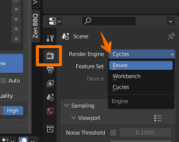
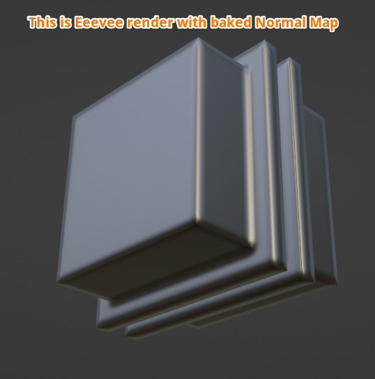

- Now we can choose Eevee render to see the result

!!! Notice
    Longer baking time and higher normal map resolution will give less artifacts.

## Exporting Normal Map

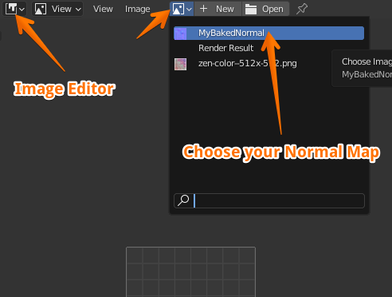

In **Image Editor**, open your baked Normal Map.

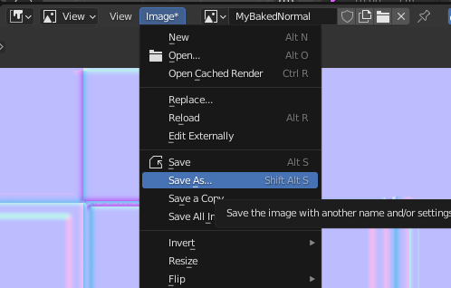

And now you can choose **Image** --- **Save As...** it for usage outside Blender.

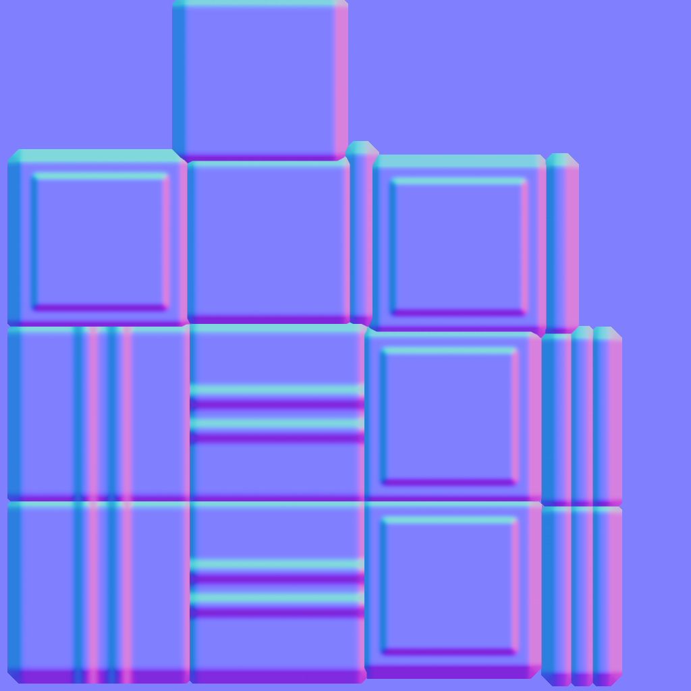

*The result baked Normal Map*