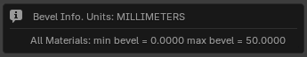

# Quick Guide: How to Use Vertex Color Mask

This guide explains how to transfer bevel data from Blender to Marmoset Toolbag 5 using vertex color masking. Bevels are created in Blender with the addon, converted to a vertex color mask, and exported with the mesh. In Toolbag, the mesh is imported, a material is assigned, the bevel shader is enabled with vertex color masking, and the bevel width is set to match the maximum value used in Blender to achieve consistent visual results.

Refer to the [Quick Start](quickstart.md) article for information on creating bevels.

## Blender

We'll begin with a scene that contains an object with bevels already created. Our goal is to transfer the bevel settings into Marmoset Toolbag and ensure that the bevels appear the same and have varying widths according to what we set up in Blender.

In this test scene, we have an object with bevel samples of 1, 2, 3, and 5 cm. The last sample has no bevel applied.

Let’s add a modifier that will create a Vertex Color Mask for use in Marmoset Toolbag.

- In the addon panel, expand the **Tools** section and click the **Node VC Mask** button.

A Geometry Nodes modifier will be added to the object, dynamically generating the vertex color and automatically updating it to reflect any changes in geometry or bevels.

!!! Tip  
    You can freely modify the Geometry Nodes of this modifier to suit your needs. However, the next time you assign it to a new object in the same scene, it will use the modified version.  
    If you want the addon to generate a fresh, default version of the node setup, simply remove all instances of the modifier from the scene. A new one will be created automatically.

To preview the result, you need to make the generated vertex color layer active and enable viewport settings to show mesh attributes.

- Expand the **Color Attributes** list and select the layer named `N_ZenBBQ_VC_Mask`.

- Switch the viewport render mode to **Solid**. Then open the render settings and enable both **Attribute** and **Flat** shading. The **Flat** option is optional, but when enabled, it displays the vertex color unaffected by lighting.

Here's the result of the modifier:

As you can see, the vertex color is red because only the red channel is used in the modifier settings. To understand the logic behind the gradient values, let’s refer to the Marmoset Toolbag documentation on [Vertex Color Masking](https://marmoset.co/posts/revolutionize-your-3d-workflow-with-toolbags-bevel-shader/).

> If you need more control, you can select a Vertex Color Mask channel to vary the size of bevels within a single material. Vertex masking uses the color value as a multiplier on the Bevel Width setting. For example, if Bevel Width is set to 5mm, a vertex color value of 0.5 would create a size of 2.5mm for that region. You can think of the Bevel Width setting as the maximum size in this case, with vertex colors being used to reduce the size where necessary.

This means we need to create a mask where the widest bevel is represented by the brightest color (1.0 in color channel value), and the others will be dimmer depending on their width. That’s exactly what we see in the final vertex color: the widest bevel (5 cm) is the brightest, and areas with no bevel are completely black.

## Marmoset Toolbag

Let’s configure the Marmoset Toolbag shader to display bevels.

- Import the test object into Toolbag.

!!! Tip
    For export/import, it’s best to use a format that supports vertex color. The default FBX settings are a good choice.

Here is the result after importing into Toolbag:

!!! Tip
    You can adjust the **Albedo** color to enhance the highlight visibility. In the image above, the Albedo color is R:91 G:85 B:102. Also, in the material's **Reflectivity** settings, **Metalness** is set to 1.0.

Right after importing the object into Toolbag, the bevels are not yet visible. To display them correctly, the material and render settings need to be configured.

As noted in the documentation, the render mode must be changed to allow bevels to appear:

> **Note:** The bevel shader is not supported in the Raster renderer. Make sure Hybrid or Ray Tracing is selected to preview the effect. Bevels can be baked to textures to view the result in Raster mode as well.

In the render settings, switch the **Render Mode** to **Ray Tracing**.

In the object’s material settings, find the **Surface** tab. Open the dropdown labeled **Normals** and select **Bevel**.

After changing the normal type, the panel will switch to the one we need for bevel configuration.

We only need to adjust two parameters: **Bevel Width (mm)** and **Vertex Color Mask**.

According to Toolbag’s documentation, we should set **Bevel Width** to match the widest bevel in our model. Let's go back to Blender.

- In Blender, select the model and use the operator [Show Max Bevel by Material](npanel.md#show-max-bevel-by-material) from the [Tools](npanel.md#tools) panel.

In the popup, select the unit of measurement used in Toolbag. You can find this in the Toolbag’s bevel field labeled **Bevel Width (mm)**. Confirm your choice by clicking **Ok**.

As a result, we see that the maximum bevel width in our object is **50 mm**.

Enter this value in Toolbag’s **Bevel Width (mm)** field in the material settings.

As expected, we now have bevels sized at 50 mm.

Next, let's add the influence of the vertex color map. Change the **Vertex Color Map** setting from **None** to one of the available vertex color channels in the model. In our case, it's the **R** channel.

The final result shows a clear variation in bevel width according to what was set up using the Zen BBQ addon.

