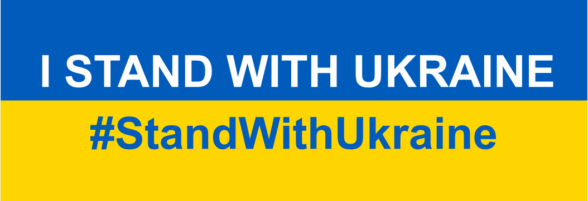
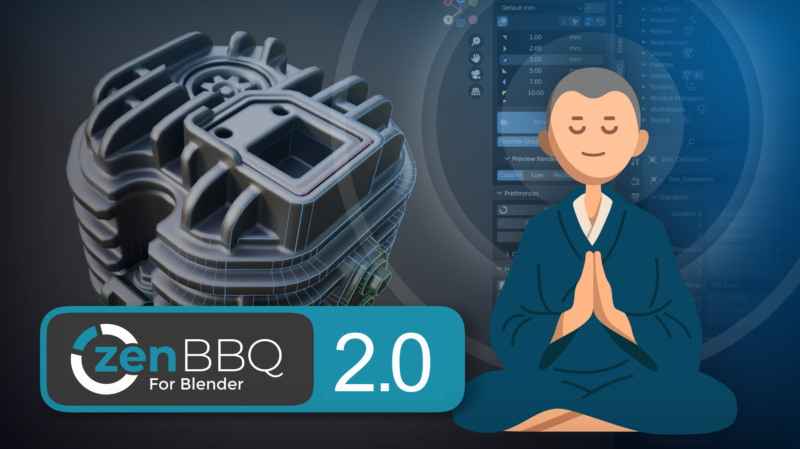

# Zen BBQ 2.0 for Blender

**Zen BBQ** (Build Bevels Quickly) is a professional toolset for Blender designed to create, adjust, visualize, and **bake** bevels in a fully non-destructive manner. By leveraging the power of the **Cycles Bevel Shader**, the addon allows you to achieve realistic rounded edges without complex topology preparation, and then seamlessly bake them into production-ready texture maps.

## Core Concepts & Advantages

Traditional workflows require significant time to maintain clean high-poly topology for Subdiv or Bevel modifiers. Zen BBQ redefines this approach through two main pillars:

* **Non-Destructive Beveling**: Bevels are generated at the shader level. Your base geometry remains simple, lightweight, and easy to edit.
* **Integrated Baking Pipeline**: Procedural bevels are not locked inside Blender. With the built-in baking tools, these shader-based effects can be instantly baked directly into standard Tangent-space Normal, Curvature, or AO maps, making the asset ready for game engines or external texturing suites.
* **Speed and Iteration**: Adjusting bevel radii happens instantly for the entire object or specific selected elements.
* **Visual Precision**: Support for real-world measurement units (mm, cm, m, in, ft) ensures the accuracy required for industrial design and architectural visualization.

## Application Areas

* **Concept Art & Design**: Effortlessly create complex shapes by intersecting meshes (Boolean-based workflow) and getting smooth transitions. (Special thanks to Tor Frick for popularizing this technique).
* **Game Development (High-poly to Low-poly workflow)**: Use Zen BBQ to prepare High-poly models. Procedural bevels bake perfectly into texture maps, saving hours of modeling time on support loops and mesh sewing.
* **Visualization**: Add realistic highlights to sharp edges, which is critical for the human eye to perceive object forms correctly.

---

## Key System Features

### 1. Bevel Management

A centralized preset system provides flexible radius control.

* **Preset Groups**: Organize sets of bevel values with different measurement units.
* **Color-Coded Overlay**: Each preset corresponds to a unique viewport color for instant visual diagnostics.
* **Edge & Vertex Attributes**: Bevel data is stored directly in mesh attributes, allowing for non-uniform, per-element width control.

👉 [**Learn more about Bevels Subpanel**](subpanel_bevels.md)

### 2. Viewport Display Engine

A powerful visualization toolset for cycling through different preview modes:

* **Material Mode**: Displays your original, unaltered user materials.
* **Shader Mode**: Real-time visualization of procedural bevels and diagnostic maps (Normal, AO, Curvature, Mask, etc.) using Cycles.
* **Image Mode**: Preview baked texture maps directly on the model to verify quality before export.

👉 [**Deep dive into Viewport Display**](subpanel_bevels.md#viewport-display-engine)

### 3. Advanced Baking Pipeline

A streamlined environment for generating Normal, AO, Curvature, and ID maps.

* **Object Monitor**: Intelligent pre-bake checklist and error logging (detects missing UVs, flipped islands, and overlaps).
* **Naming Templates**: Automation of file naming using dynamic tokens like `%OBJECT%` and `%SUFFIX%`.
* **Sampling Presets**: Quick toggles between Low, Medium, and High quality profiles for baking.

👉 [**Bake Panel Guide**](subpanel_bake.md) | [**Manual Baking Tutorial**](manual_normal_map_baking.md)

### 4. Workflow Utilities (Tools)

* **Live Boolean Integration**: Automatically assigns a default bevel radius to new intersection edges created by non-destructive Boolean modifiers. [**Read more**](live_boolean.md).
* **Normal Map Tools**: Includes the **Explode System** for artifact-free baking, **Weighted Normal** injection, and the **Normal Mixer** for blending procedural bevels with micro-textures.
* **Vertex Color Mask**: Encodes bevel parameters into Vertex Color attributes for export to external suites like **Marmoset Toolbag**.

👉 [**Tools Overview**](subpanel_tools.md) | [**Marmoset Toolbag Integration**](marmoset-integration.md)

### 5. Zen Multi-Panel UI

Featuring a modular interface where you can customize your workspace by pinning subpanels and rearranging their order.

👉 [**Main Panel Overview**](main_panel.md) | [**Pie Menu Guide (Ctrl+Shift+X)**](piemenu.md)

---

## Quick Navigation

1.  [**Installation**](installation.md) — How to install and activate the addon.
2.  [**Quick Start**](quickstart.md) — Essential steps: assigning, previewing, and baking.
3.  [**Preferences**](subpanel_preferences.md) — Customizing hotkeys, UI styles, and default behaviors.
4.  [**Troubleshooting**](troubleshooting.md) — Common questions and solutions.

**Zen BBQ — Build Bevels Quickly!**

---

 [**Gumroad**](https://sergeytyapkin.gumroad.com/l/zenbbq) |  [**BlenderMarket**](https://www.blendermarket.com/products/zen-bbq) |  [**Discord**](https://discord.gg/wGpFeME)