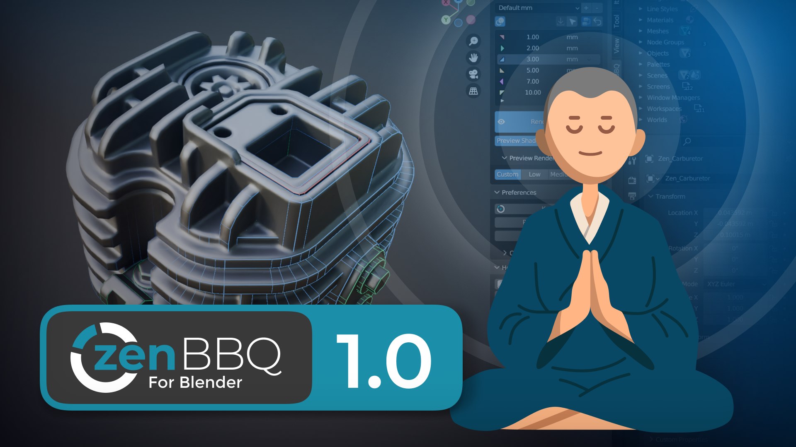
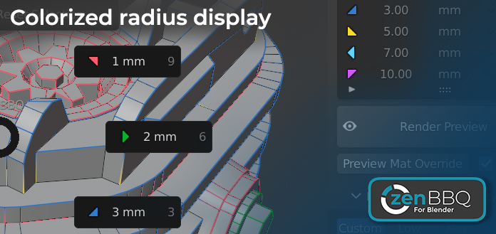

# Zen BBQ 1.0 for Blender

## Quick Start

- [**Installation**](installation.md)
- [**Quick Start Guide**](quickstart.md)

<!-- blank line -->
<!-- 

<iframe width="1018" height="573" src="https://www.youtube.com/embed/iI1JWrOn2ys" title="YouTube video player" style="position: absolute; top: 0; left: 0; width: 100%; height: 100%;" allowfullscreen="" seamless="" frameborder="0"></iframe>

 -->
<!-- blank line -->

## Introduction

**Zen BBQ** is intended to create, tune and visually control bevel effect without actually changing geometry.

In contrast to traditional way, it does not require setting up supporting loops or accurately connect parts.

Instead, Zen BBQ uses Cycles render engine and Blender Bevel Shader Node to render the effect and its carefully crafted set of tools will give you full control over it with less effort.

It is great to make quick renders for sketches or bake basic normal maps for gamedev lowpoly models.

**Zen BBQ — Build Bevel Quickly!**

 

 

 

**Enjoy this experience with us!**

 [**Gumroad**](https://sergeytyapkin.gumroad.com/l/zenbbq) |  [**BlenderMarket**](https://www.blendermarket.com/products/zen-bbq) |  [**Discord**](https://discord.gg/wGpFeME)

<!-- blank line -->
 
<!-- blank line -->
