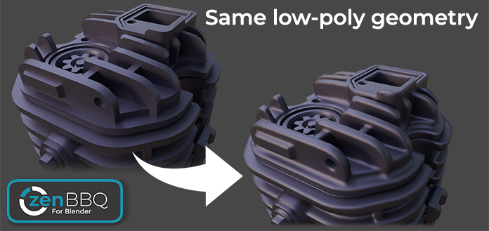
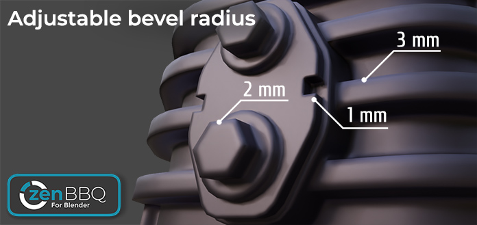

# Zen BBQ 1.0 for Blender

## Quick Start

- [**Installation**](installation.md)
- [**Quick Start Guide**](quickstart.md)
- [**Quick Guide How to Bake Normal Map**](bake-tutor-1.md)

<!-- blank line -->
<!-- 

<iframe width="1018" height="573" src="https://www.youtube.com/embed/iI1JWrOn2ys" title="YouTube video player" style="position: absolute; top: 0; left: 0; width: 100%; height: 100%;" allowfullscreen="" seamless="" frameborder="0"></iframe>

 -->
<!-- blank line -->

## Introduction

Zen BBQ is an add-on for creating, adjusting and visualizing Bevels in a couple of clicks! Are you tired of preparing geometry for the Subd or Bevel modifiers? Look no further! 

### Application area
- **Visualization**. Bevels catch light and help the eye to define object shapes better. Make your models more realistic and appealing without changing geometry!
- **Concept Art**. Design awesome objects easily! Just stick Mesh Elements into each other, get smooth transitions and create cool shapes. Special thanks to Tor Frick!
- **Game Development**. Don't forget that BBQ Bevels can be baked into Normal Maps for GameDev models. Save hours of your time without cutting support loops for your High-poly model!

### Main Features
- **Full control over Bevel Shader Node** in Cycles. Set Values for the entire model or for each Edge and Vertex individually.
- **The whole range of Measurement Units**. Set Bevel Radius in MM, CM, M, KM, IN, FT etc.
- **Custom Preset Groups**. Use existing Bevel Preset Groups with different Units or create your own.
- **Friendly to your Materials**. Zen BBQ stores its Values in the mesh attributes and embeds into your Materials in a non-destructive way.
- **Smart Render Preview System**. Preview Bevels in one click!
- **Viewport Display** System. Visually control each Bevel Preset by color in Viewport.
- **Intuitive UI** with multifunctional Main and Pie menus.
- **Quick Support** on the Discord channel.

 **Zen BBQ - Build Bevels Quickly!**

 
<!--
  -->

  

  

 
 
**Enjoy this experience with us!**

 [**Gumroad**](https://sergeytyapkin.gumroad.com/l/zenbbq) |  [**BlenderMarket**](https://www.blendermarket.com/products/zen-bbq) |  [**Discord**](https://discord.gg/wGpFeME)
