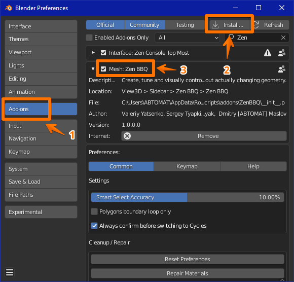

# Zen BBQ Installation

- Open **Preferences --- Add-ons** window in Blender.
- Click **Install** button and choose zip-archive with the add-on.
- Make sure that its checkbox is enabled in Blender's add-on list.

<!-- Also, you can [**watch the video**](https://youtu.be/dqpgWcRBE4o?t=17) how to install it. -->

