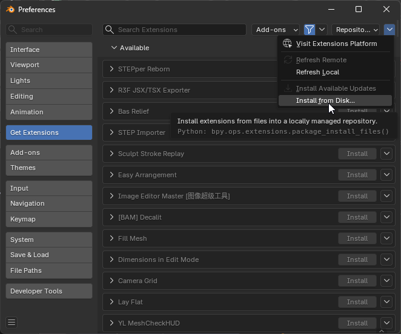

# Zen BBQ Installation

There are two easy methods to install **ZenBBQ** archive directly into Blender.

---

## Method 1: Drag and Drop (Recommended)

The fastest and most intuitive way to install the local extension:

1. Open **Blender**.
2. Open your operating system's file manager and locate the downloaded **`ZenBBQ_2_0.zip`** file.
3. Simply **drag the `.zip` file** and **drop it directly into the Blender 3D Viewport**.
4. Confirm the action by clicking **Install** in the popup prompt.

---

## Method 2: Install from Disk (Via Preferences)

If you prefer using Blender's standard menus:

1. Go to the top menu and open **Edit --- Preferences**.
2. Navigate to the **Get Extensions** tab on the left.
3. Click the **arrow icon** ▾ (dropdown menu) located in the top-right corner of the Extensions window.
4. Select **Install from Disk...** from the dropdown list.
5. In the file browser, locate and select your downloaded **`ZenBBQ_2_0.zip`** file.
6. Verify that the **Zen BBQ** checkbox is checked (enabled) in your extensions list.

|  |
|:---:|
| *Fig. 1. Blender Preferences panel. |

---

## Technical Requirements & Verification

* **Blender Version:** Because Zen BBQ 2.0+ relies on the local extension architecture, it requires **Blender 4.2 LTS** or newer. For legacy versions of Blender, please use the legacy Zen BBQ 1.x addon format.
* **Accessing the UI:** Once successfully installed and activated, Zen BBQ will appear in the **N-Panel** (sidebar) of your 3D Viewport under the **Zen BBQ** tab. Alternatively, you can summon the **Pie Menu** using the global hotkey: `Ctrl + Shift + X`.