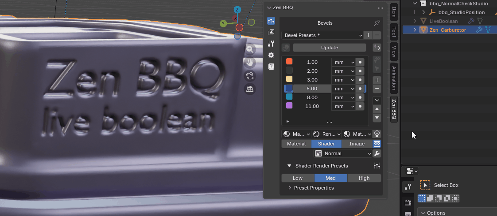

# Live Boolean Integration

|  |
|:---:|
| *Fig. 1. Live Boolean Preview.* |

The **Live Boolean** integration in Zen BBQ ensures a seamless, non-destructive modeling workflow when combining Blender's native Boolean modifiers with procedural bevels. 

When you perform boolean cuts, Blender dynamically generates new intersection edges. Without proper integration, these new edges lack bevel weight and break the visual continuity of your model. Zen BBQ solves this by automatically managing the bevel weights on dynamically created geometry.

---

## Key Settings

### Set Default Radius
The primary control for non-destructive boolean workflows is located in the Zen BBQ settings:

* **Set Default Radius:** Specifies the fallback bevel radius that will automatically be assigned to any newly generated intersection edges created by Blender's non-destructive Boolean modifiers. This ensures that your procedural bevels remain seamless and present on newly cut geometry without manual reassignment.

---

## How It Works (Workflow)

1. **Enable Live Link:** Ensure your target mesh has an active Zen BBQ bevel setup applied.
2. **Apply a Boolean Modifier:** Cut, union, or intersect your mesh using Blender's Boolean modifier (or helper addons like BoxCutter / HardOps).
3. **Automatic Bevel Assignment:** Zen BBQ detects the newly generated intersection edges on the fly and immediately assigns the preset **Default Radius** to them.
4. **Adjust on the Fly:** You can change the global fallback radius at any time, and all non-destructive boolean cuts on the object will update their bevel widths accordingly.

> 💡 **Note:** To customize default behavior and default measurement units for the fallback radius, refer to the [Zen BBQ Preferences documentation](subpanel_preferences.md).

---

[ **Gumroad**](https://sergeytyapkin.gumroad.com/l/zenbbq) | [ **Superhive**](https://blendermarket.com/products/zen-bbq) | [ **Discord**](https://discord.gg/wGpFeME)