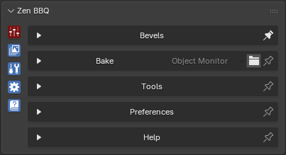

# Main Panel

|  |
|:--:|
| *Fig. 1. Zen BBQ Main Panel* |

Starting from version 2.0.0, the Main Panel has been redesigned into the **Zen Multi-Panel**. This new structure makes the addon UI highly customizable and allows you to build the perfect workspace for your current needs in just a few clicks.

## Subpanels

The Main Panel contains the following tabs:

- **[Bevels.](subpanel_bevels.md)** Used for assigning and authoring bevels. Here you can also create bevel size presets for your project and configure the visual representation of your object in the Blender viewport.
- **[Bake.](subpanel_bake.md)** Contains settings for baking normal maps and other map types required for your project pipeline.
- **[Tools.](subpanel_tools.md)** Features a set of utility tools designed to help you create high-quality bevels, optimize the baking process, and export data for further processing in third-party applications.
- **[Preferences.](subpanel_preferences.md)** Configures global addon settings to fit your personal workflow.
- **[Help.](subpanel_help.md)** Provides direct access to documentation and links to download demo scenes used in tutorials.

## Multi-Panel Features

Clicking the icons on the left side of the panel switches between different subpanels. Each subpanel has a **Pin** icon located to the right of its name. 

- **Pin Panel:** Click the Pin icon to lock the subpanel so it stays open when you switch to another tab.
- **Alternative Pin:** You can achieve the same result by holding **Ctrl** while clicking a subpanel icon.
- **Open Multiple Panels:** To open several subpanels simultaneously, hold down the **Shift** key while clicking the subpanel icons.

The image above demonstrates the status of the subpanels, which is indicated by the color-coding of their icons:

- **Pinned Status (Red):** The icon for the top **Bake** panel is colored red, and the Pin icon to the right of its name is filled. This indicates that the panel is locked (pinned) and will remain visible when you interact with other panels.
- **Active Status (Cyan/Blue):** The other active icons are colored cyan, meaning they are currently open but not locked. Their Pin icons are displayed as unfilled outlines.
- **Inactive Status (No Color):** If a subpanel is closed and inactive, its icon will have no color indicator.