# Manual Normal Map Baking Guide

While Zen BBQ features a fully automated [Bake Panel](subpanel_bake.md) for one-click texture generation, understanding how to bake normal maps manually using Blender's native Cycles engine is highly valuable. This guide walks you through the step-by-step manual baking pipeline for Zen BBQ bevels.

---

## 1. Prepare UVs

Before baking, ensure your target mesh has a clean, bake-ready UV layout. While this guide assumes basic UV mapping knowledge, keep these key hard-surface rules in mind:

* **UV Island Margins:** Ensure there is sufficient padding (margin) between UV shells to prevent edge-bleeding artifacts.
* **Hard Edges Separation:** Any geometric hard/sharp edge **must** be split into separate UV islands to avoid nasty shading seams on your normal map.

| 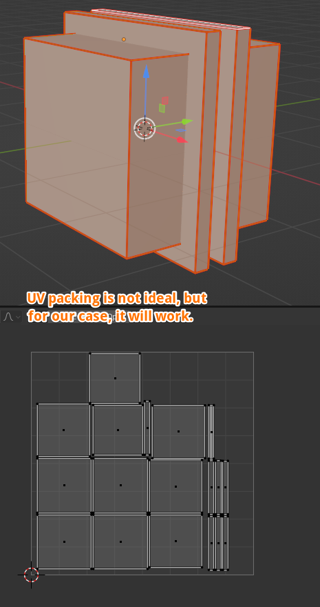 |
|:---:|
| *Fig. 1. A clean hard-surface UV layout with adequate padding and split hard edges.* |

---

## 2. Setup the Target Image Node

1. Select your object and open the **Shader Editor**.
2. Add a new Image Texture node by pressing `Shift + A` and selecting **Texture ➔ Image Texture**.

| 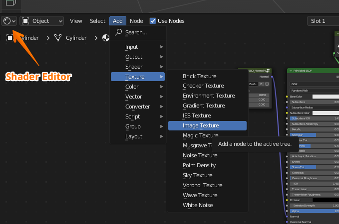 |
|:---:|
| *Fig. 2. Creating a new Image Texture node in the Shader Editor.* |

3. Click the **New** button inside the image node to create a blank canvas.

| 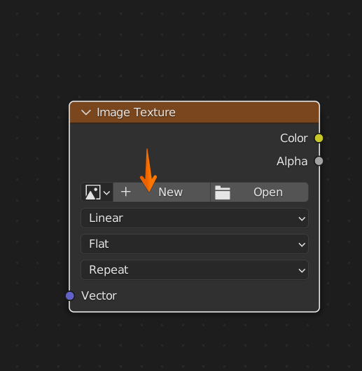 |
|:---:|
| *Fig. 3. Initializing a new texture inside the node.* |

4. Configure the texture settings in the pop-up dialog:
    * **Name:** Give your texture a clear name (e.g., `MyBakedNormal`).
    * **Width & Height:** Choose your resolution (typically `2048 x 2048` or `4096 x 4096`).
    * **Alpha:** Uncheck this option, as alpha channels are not utilized for standard tangent-space normal maps.
    * Click **OK**.

| 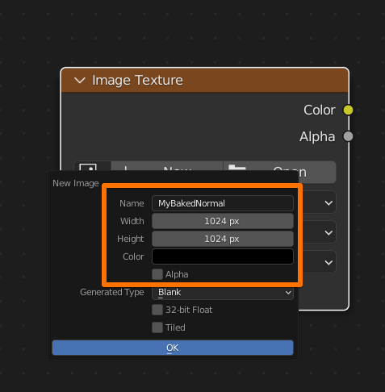 |
|:---:|
| *Fig. 4. Setting resolution and disabling Alpha.* |

5. **Crucial Step:** Change the **Color Space** dropdown on the node from *sRGB* to **Non-Color**. If this is missed, Blender will apply a gamma curve, distorting your normal map vectors completely.

| 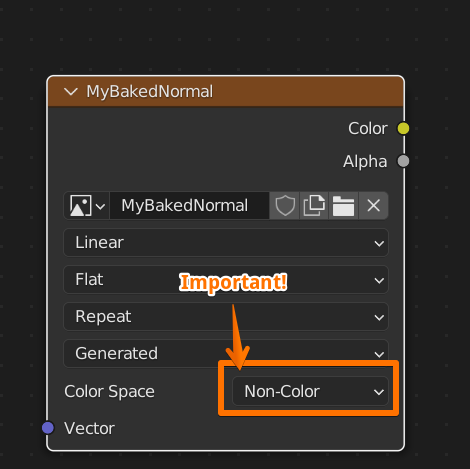 |
|:---:|
| *Fig. 5. Switching Color Space to Non-Color.* |

6. Leave this node floating in your shader graph. **Do not connect it to any input**. Simply keep it selected (highlighted with a white outline) so Blender knows this is the active baking target.

| 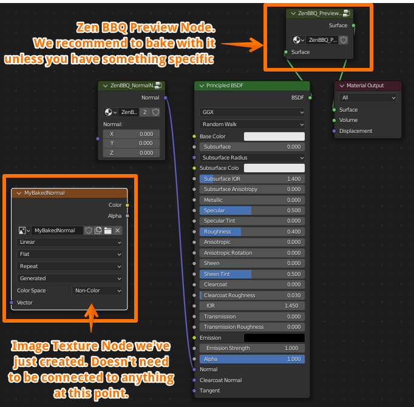 |
|:---:|
| *Fig. 6. The active, unconnected target image node inside the material graph.* |

!!! tip "Previewing the Bevels"
    To visualize and bake the procedural bevels correctly, ensure you have enabled the preview in the Zen BBQ N-Panel. Go to the **Bevels** panel and switch the preview mode to **Shader** (this temporarily overrides the material with the viewport bevel shader).

---

## 3. Blender Baking Settings

1. Make sure your active rendering engine in the **Render Properties** tab is set to **Cycles** (baking is not supported in Eevee).
2. To ensure high-quality normal map generation, open the Zen BBQ **Bake** panel, find **Bake Render Presets**, and select the **High** preset.

| 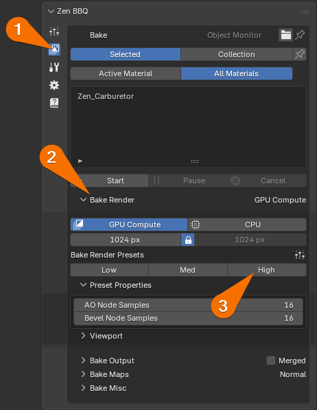 |
|:---:|
| *Fig. 7. Setting the Bake Render Preset to High in the Zen BBQ panel.* |

3. Scroll down to the **Bake** accordion in the native **Render Properties** tab and configure as follows:
    * **Bake Type:** `Normal`
    * **Selected to Active:** `Off` (since we are baking procedural bevels directly onto the same low-poly mesh).
    * **Margin Type:** `Extend` (or set a custom margin size in pixels to match your padding).

| 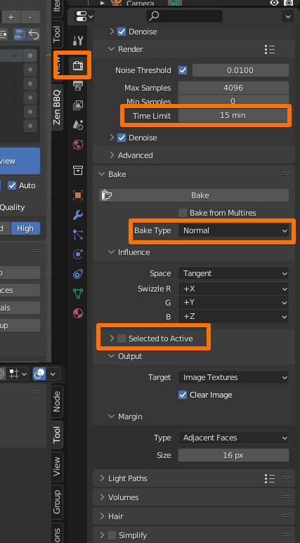 |
|:---:|
| *Fig. 8. Native Blender Cycles baking configuration.* |

4. Under the Cycles **Render** settings, we recommend setting a **Time Limit** (e.g., 5 to 15 minutes) under the Noise Threshold options. The longer you allow the engine to render, the cleaner and more noise-free your final normal map will be.

---

## 4. Execute Bake

Once everything is configured and your target image node is highlighted in the Shader Editor, scroll down to the bottom of the **Bake** accordion and click **Bake**.

| 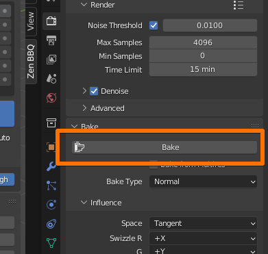 |
|:---:|
| *Fig. 9. Triggering the native Blender baking process.* |

A progress bar will appear at the bottom of the Blender window. Wait until the process reaches 100%.

---

## 5. Verify the Shading Results

Once baking is complete, let's plug the new map into the material to verify the visual result.

1. In the Zen BBQ **Bevels** panel, switch the preview mode from *Shader* back to **Material** to restore your original shader setup.
2. Press `Shift + A` and add a **Vector ➔ Normal Map** node.
3. Connect the nodes as follows:
    * Connect the **Color** output of your *Image Texture* node to the **Color** input of the *Normal Map* node.
    * Connect the **Normal** output of the *Normal Map* node to the **Normal** input of your material's *Principled BSDF*.

| 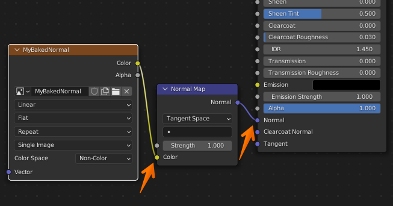 |
|:---:|
| *Fig. 10. Connecting the baked normal map texture to the Principled BSDF.* |

4. Adjust your material settings to evaluate the highlights (e.g., set a dark grey **Base Color**, increase **Metallic** to `1.0`, and lower **Roughness** to `0.2`).
5. You can now safely switch your render engine to **Eevee** to inspect the real-time viewport response.

| 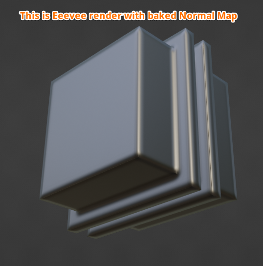 |
|:---:|
| *Fig. 11. Clean, procedurally generated bevel highlights rendering in real-time via Eevee.* |

---

## 6. Exporting the Normal Map

Blender does not automatically save baked images to your hard drive. If you close the blend file now, your baked data will be lost.

1. Switch one of your workspace editors to the **Image Editor**.
2. Click the image selector dropdown at the top and select your baked normal map (e.g., `MyBakedNormal`).

| 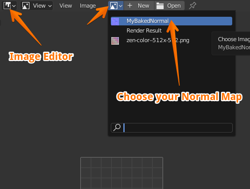 |
|:---:|
| *Fig. 12. Locating your baked normal map in the Image Editor.* |

3. Go to **Image ➔ Save As...** in the top header and save your file to your project directory (typically as a 16-bit PNG or Targa).

| 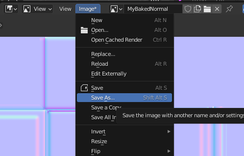 |
|:---:|
| *Fig. 13. Exporting the final map for use in external game engines or renderers.* |

| 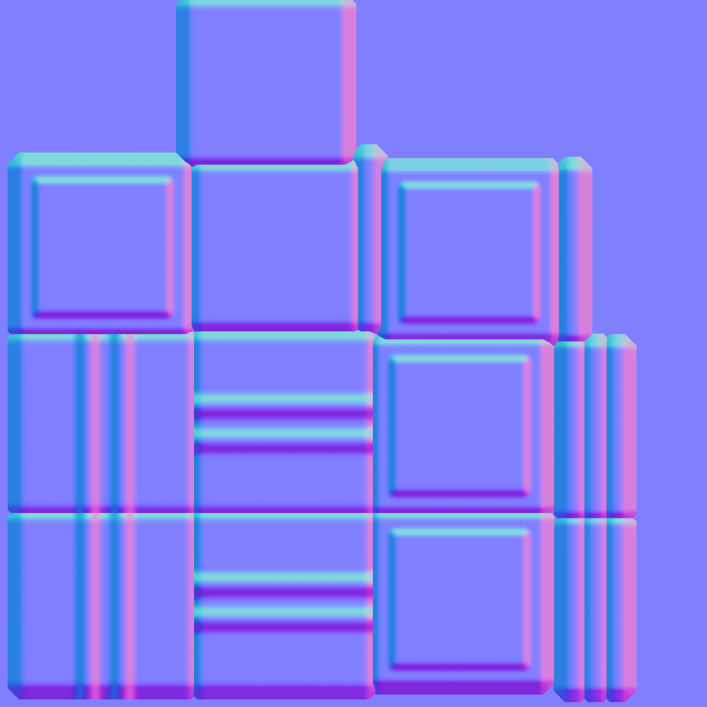 |
|:---:|
| *Fig. 14. The final exported tangent-space normal map.* |