# Marmoset Toolbag Integration Guide

This guide details the pipeline for transferring procedural bevel radius data from Blender to **Marmoset Toolbag 5** using dynamic or static **Vertex Color Masking**. By leveraging Zen BBQ's attribute baking, you can achieve 100% consistent, variable-width procedural bevels inside Marmoset's high-fidelity real-time viewport.

For a quick reference on standard bevel creation, please refer to the [Quick Start](quickstart.md) guide.

---

## 1. Blender Setup

To demonstrate this workflow, we will use a test asset with assigned bevel widths of **1 cm, 2 cm, 3 cm, and 5 cm**, alongside a section with no bevel applied.

| 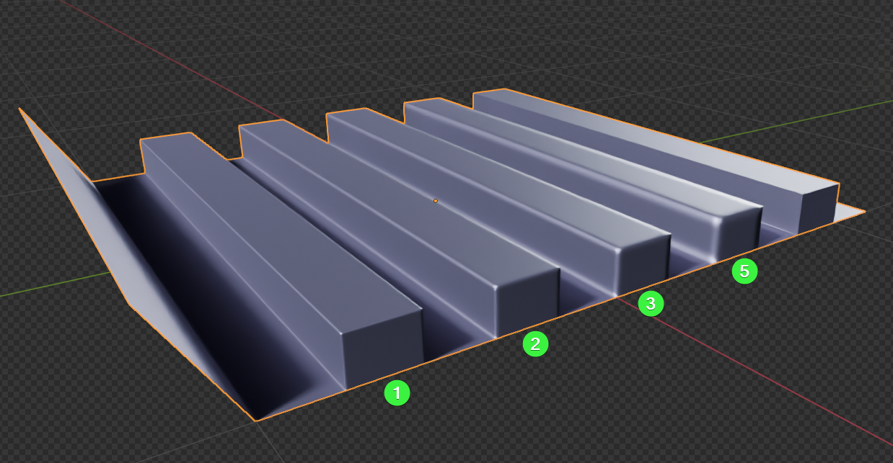 |
|:---:|
| *Fig. 1. Test asset displaying physical bevel presets ranging from 1 cm to 5 cm.* |

Our goal is to dynamically encode these measurement parameters into vertex attributes so Marmoset Toolbag can interpret them accurately.

### Step 1.1: Generate the Dynamic Vertex Color Mask

We will use a dynamic Geometry Nodes modifier to automate the vertex mask generation.

1. Select your target mesh.
2. Open the Zen BBQ N-Panel, expand the **Tools** section, and click **Node VC Mask**.

| 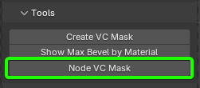 |
|:---:|
| *Fig. 2. The Node VC Mask tool location in the Tools panel.* |

This operator automatically appends a custom Geometry Nodes modifier to your modifier stack, which dynamically maps physical bevel metrics to active vertex colors.

| 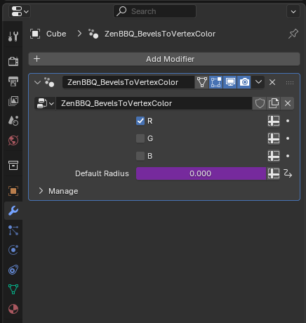 |
|:---:|
| *Fig. 3. Active Geometry Nodes modifier generating the dynamic VC mask.* |

!!! tip "Customizing Node Setups"
    You are free to customize the internal logic of this generated Geometry Nodes modifier. However, any modifications will be stored in the scene. If you need to generate a fresh, default version of the Zen BBQ node setup, simply delete all instances of the modifier from your scene and re-run the **Node VC Mask** operator.

### Step 1.2: Preview and Verify the Color Attributes

Before exporting, you should verify the gradient values of the mask in the viewport.

1. Go to the **Data Object Properties** tab, expand **Color Attributes**, and ensure the dynamic layer `N_ZenBBQ_VC_Mask` is selected and active.

| 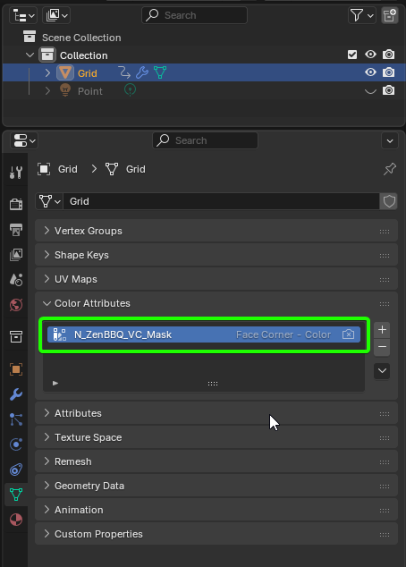 |
|:---:|
| *Fig. 4. Selecting the generated attribute layer under Color Attributes.* |

2. Switch your viewport shading mode to **Solid**.
3. Open the **Viewport Shading options**, and set the Color source to **Attribute** and the lighting to **Flat** (Flat rendering allows you to evaluate the raw vertex color values without 3D lighting interference).

| 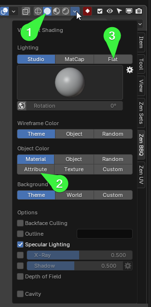 |
|:---:|
| *Fig. 5. Viewport Shading configuration for flat attribute preview.* |

The viewport will display a red gradient mask on your mesh:

| 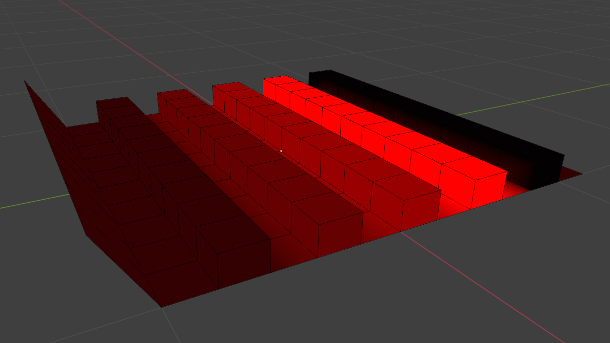 |
|:---:|
| *Fig. 6. Red channel gradient representation of different bevel widths.* |

### Understanding the Masking Logic

Marmoset Toolbag uses vertex masking as a normalized multiplier over its global **Bevel Width** parameter. 
* A vertex color value of `1.0` (pure red/white) outputs **100%** of Marmoset's set bevel width.
* A vertex color value of `0.5` outputs **50%** of the set bevel width.
* Pure black (`0.0`) outputs **no bevel**.

Therefore, Zen BBQ maps your widest active bevel (5 cm) to the maximum intensity of `1.0` in the Red channel, scaling down all narrower bevels proportionally.

---

## 2. Exporting the Asset

To preserve custom color layers, export your mesh using a format that natively supports custom vertex attributes.

* **Recommended Format:** **FBX** (Default export settings will preserve the `N_ZenBBQ_VC_Mask` layer seamlessly).
* **Static Alternative:** If you are using applied geometry or need to utilize the Alpha channel (which Blender's Geometry Nodes cannot output), use the static **Create VC Mask** operator instead to export via `G_ZenBBQ_VC_Mask`.

---

## 3. Marmoset Toolbag Configuration

Import your exported asset into Marmoset Toolbag.

| 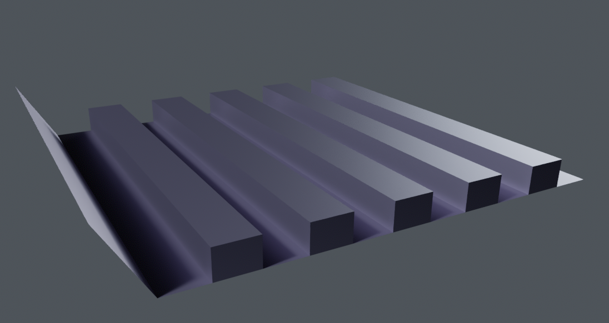 |
|:---:|
| *Fig. 7. The base mesh imported into Marmoset Toolbag without active bevel normal maps.* |

!!! tip "Aesthetic Tip for Testing"
    To see highlight contours more clearly, assign a dark metallic material to your object (e.g., set **Albedo** to `R:91 G:85 B:102` and **Metalness** to `1.0` under Reflectivity).

### Step 3.1: Enable Ray Tracing

!!! warning "Renderer Support"
    Marmoset Toolbag's procedural bevel shader is **not supported** in the standard Raster renderer. You must use a ray-traced engine to preview the viewport effect. (However, you can bake these ray-traced bevels down into static normal maps to use them in raster mode later).

1. Go to the **Render** settings.
2. Switch the **Render Mode** to **Ray Tracing** (or Hybrid).

| 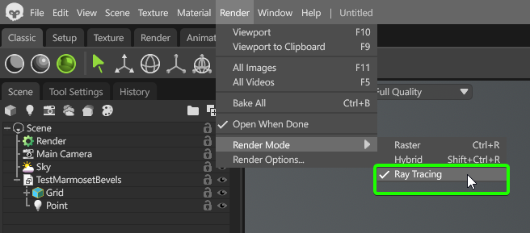 |
|:---:|
| *Fig. 8. Setting the renderer to Ray Tracing mode.* |

### Step 3.2: Configure the Bevel Shader

1. Select your object's material.
2. Under the **Surface** settings block, open the **Normals** dropdown and select **Bevel**.

| 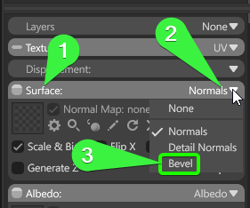 |
|:---:|
| *Fig. 9. Assigning the Bevel Normal shader type.* |

This expands the Bevel Normal options panel where we will map our vertex color data.

| 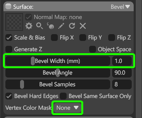 |
|:---:|
| *Fig. 10. Default Bevel Normal parameter UI.* |

### Step 3.3: Set the Calibration Scale (Max Bevel)

Because Marmoset's shader scales the vertex color mask downwards, we must configure the shader's **Bevel Width (mm)** to match the **widest physical bevel** present on our Blender asset.

1. In Blender, select the model.
2. In the **Tools** panel, run the [Show Max Bevel by Material](subpanel_tools.md/#show-max-bevel-by-material) diagnostic tool.

| 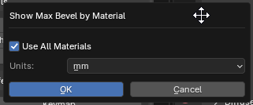 |
|:---:|
| *Fig. 11. Launching the Max Bevel diagnostic scan.* |

3. In the unit configuration prompt, select **Millimeters** to match Marmoset's input field, and click **OK**.

| 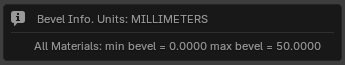 |
|:---:|
| *Fig. 12. Scanning diagnostic result showing a maximum width of 50.0 mm.* |

The tool reports that our widest bevel is **50.0 mm**.

4. Return to Marmoset Toolbag and input **50.0** directly into the **Bevel Width (mm)** field.

| 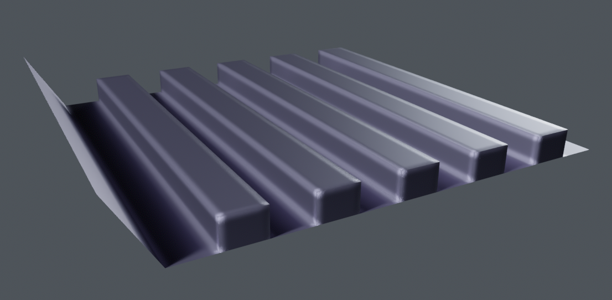 |
|:---:|
| *Fig. 13. High-resolution rendering with a flat 50.0 mm bevel applied globally.* |

At this point, Marmoset applies a uniform 50.0 mm bevel to all edges, ignoring the varying widths set in Blender.

### Step 3.4: Assign the Vertex Color Channel

To restore the varying bevel widths, we must feed the vertex color mask into the shader.

1. In the material properties under the Bevel normal tab, change **Vertex Color Mask** from **None** to the channel you baked your mask into.
2. For our dynamic node setup, select the **R** (Red) channel.

| 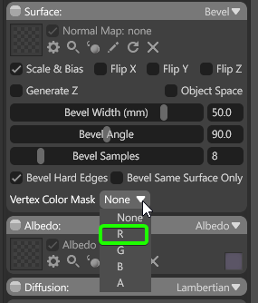 |
|:---:|
| *Fig. 14. Assigning the red channel as the scaling multiplier.* |

Marmoset immediately processes the vertex color attributes, scaling each edge's bevel width dynamically to match the exact dimensions established inside Blender.

| 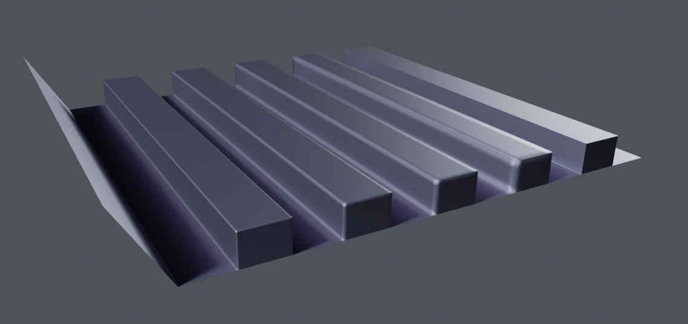 |
|:---:|
| *Fig. 15. The final real-time render matching our physical 1-5 cm bevel ranges precisely.* |

---

[ **Gumroad**](https://sergeytyapkin.gumroad.com/l/zenbbq) | [ **Superhive**](https://blendermarket.com/products/zen-bbq) | [ **Discord**](https://discord.gg/wGpFeME)