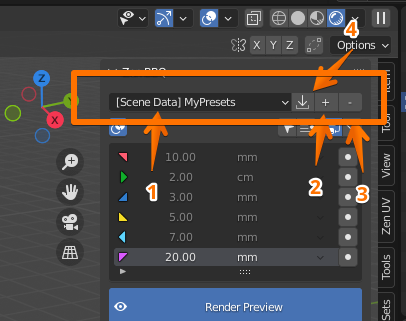
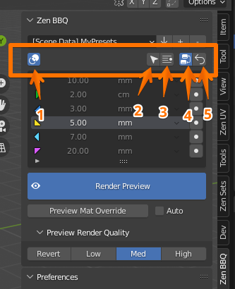
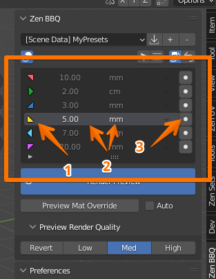
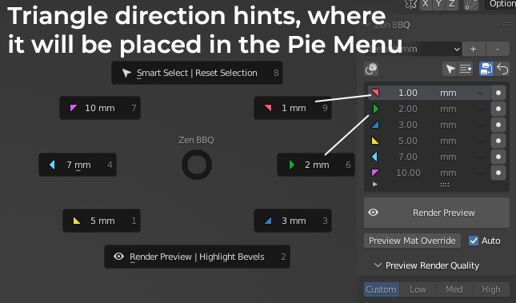
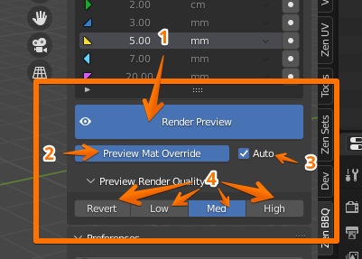
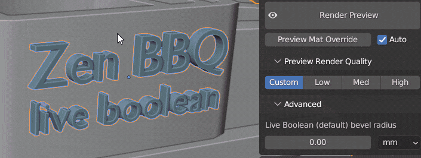
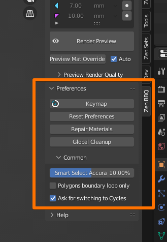
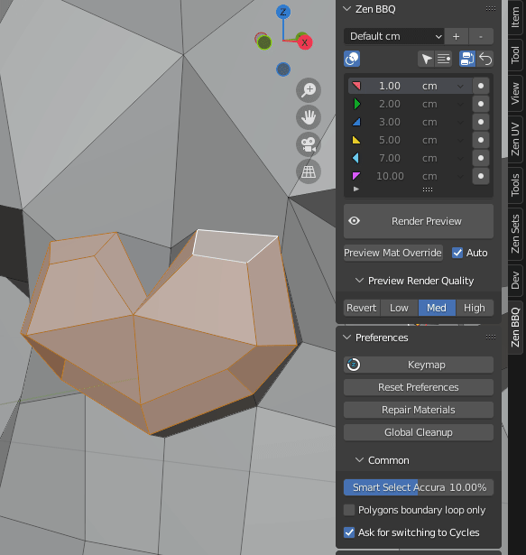
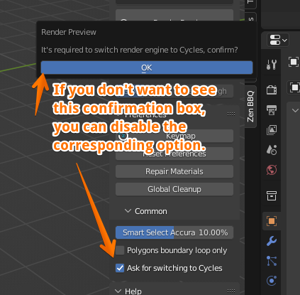
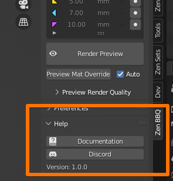

# N-Panel

## Main Panel

### Preset Group Selection

Please see [**Quick Start Guide**](quickstart.md#managing-presets) for instructions.

#### 1. Bevel Preset Groups List Dropdown
Allows you to select a preset group.
#### 2. Add new Bevel Preset Group
Allows you to add a custom preset group.
#### 3. Remove Bevel Preset Group
Allows you to remove the currently selected bevel preset group.
#### 4. Import Bevel Preset Group
Appears only if you open a scene that contains a bevel preset group that you don't have in your preferences. Allows you to save it from scene to your preferences for further usage.

### Tools Block

#### 1. Toggle Highlight Bevels On/Off

Available only in Mesh Edit Mode. Toggles Highlight Bevels function on/off.

#### 2. Smart Select

Available only in Mesh Edit Mode. Selects the geometry that has the same assigned bevel radius to the selection. See [**Quick Start Guide**](quickstart.md#smart-select-with-n-panel)

#### 3. Select by Preset

Available only in Mesh Edit Mode. Selects the geometry that has the same assigned bevel radius to the preset that is currently chosen in the list below. See [**Quick Start Guide**](quickstart.md#select-by-preset)

#### 4. Toggle material shader node

To visualize bevel effect, the shader node is needed. It is assigned automatically to the object's materials at first add-on usage on this object. But you can toggle it manually by using this button.

#### 5. Reset Selection

On Object Mode it resets the whole object to default state.
In Mesh Edit Mode it sets zero bevel radius to the selection or, if no geometry selected, to all object's geometry.

### Presets List

Please see [**Quick Start Guide**](quickstart.md#managing-presets) for instructions.

#### 1. Color Marker

Color that will be used to show this bevel radius when the Highlight Bevels function is on. These 6 presets will be also included into the Pie Menu, clockwise. Triangle direction on the icon corresponds the position of this option in the Pie Menu.

#### 2. Radius value and measurement unit

Radius value and measurement unit, both editable.

#### 3. Assign button

Assigns the corresponding preset to the selection.

### Render Preview

Please see [**Quick Start Guide**](quickstart.md#previewing-the-result) for instruction.

#### 1. Render Preview Toggle
Toggles Render Preview mode.
#### 2. Preview Material Override Toggle
Toggles overriding material of the selected objects with bevel shader for slear bevel view.
#### 3. Automatically Preview Material Override Toggle
The previous function is toggled synchronously with the Render Preview Toggle.
#### 4. preview Render Quality
Three options for preview render quality (Low, Medium and High). The first button (Revert/Custom) allows to restore the user's settings that were before one of built-in quality options was activated.

If you will be baking normal maps, please make sure that you're using the High option for best results.

### Live Boolean

_You can find the example from the animated image above in scene "Carburetor" in Help/Examples panel_

ZenBBQ has Live Boolean support. To adjust the bevel radius for at the intersection surfaces, select the desired object and use the __Live Boolean (default) bevel radius__ at the __Advanced__ subpanel (as shown in the animated image above).

## Preferences

### Keymap

Calls keymap settings window where you can set custom hotkeys for the add-on's functions.

### Reset Preferences

Resets Zen BBQ add-on preferences to its default state (including the bevel presets!),

### Repair Materials

Removes all bevel override shader nodes from user's materials and brings back the bevel shader node if it was used in that material.

### Global Cleanup

Cleans up all objects and user's materials in scene from Zen BBQ, removes Zen BBQ default material and shader nodes from the scene.

### Common

#### Smart Select Accuracy

Adjusts accuracy of Smart Select and Select by Preset functions. In most cases, the default value of 10% is fine.

#### Polygons boundary loop only

When you assign bevel in polygon editing mode, you can assign it to the boundary adges of selection only by turning this option on.

#### Ask for switching to Cycles

Zen BBQ requires Cycles render engine to show you result, so it automatically switches it when it's needed. For example if you click "Render Preview" in a new scene. With this option disabled, Zen BBQ shall not ask for confirmation once it needs to switch render engine to Cycles.

## Help

### Documentation
[Link to Zen BBQ Documentation](https://zen-masters.github.io/Zen-BBQ/)
###  [**Discord**](https://discord.gg/wGpFeME)

[Discord channel](https://discord.gg/wGpFeME) for user feedback, bug reports, and quick help with Zen BBQ.
### Version
Shows the current version of Zen BBQ

