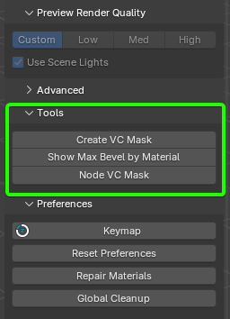
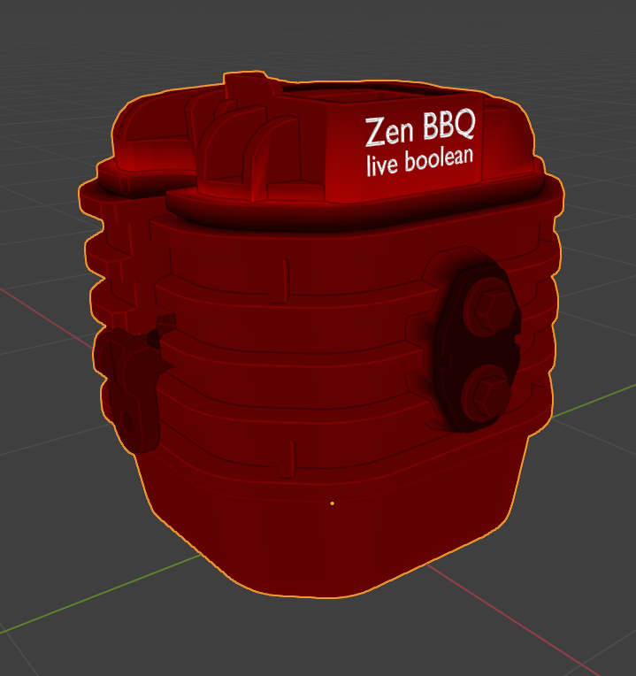
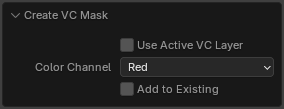
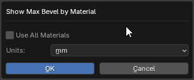
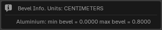
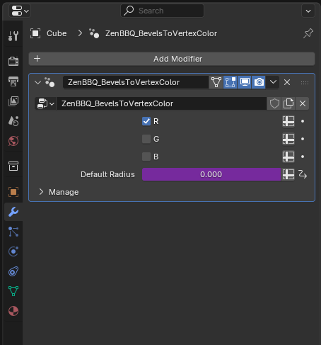
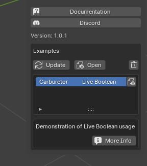

# N-Panel

## Main Panel

### Preset Group Selection

Please see [**Quick Start Guide**](quickstart.md#managing-presets) for instructions.

#### 1. Bevel Preset Groups List Dropdown
Allows you to select a preset group.
#### 2. Add new Bevel Preset Group
Allows you to add a custom preset group.
#### 3. Remove Bevel Preset Group
Allows you to remove the currently selected bevel preset group.
#### 4. Import Bevel Preset Group
Appears only if you open a scene that contains a bevel preset group that you don't have in your preferences. Allows you to save it from scene to your preferences for further usage.

### Tools Block

#### 1. Toggle Highlight Bevels On/Off

Available only in Mesh Edit Mode. Toggles Highlight Bevels function on/off.

#### 2. Smart Select

Available only in Mesh Edit Mode. Selects the geometry that has the same assigned bevel radius to the selection. See [**Quick Start Guide**](quickstart.md#smart-select-with-n-panel)

#### 3. Select by Preset

Available only in Mesh Edit Mode. Selects the geometry that has the same assigned bevel radius to the preset that is currently chosen in the list below. See [**Quick Start Guide**](quickstart.md#select-by-preset)

#### 4. Toggle material shader node

To visualize bevel effect, the shader node is needed. It is assigned automatically to the object's materials at first add-on usage on this object. But you can toggle it manually by using this button.

#### 5. Reset Selection

On Object Mode it resets the whole object to default state.
In Mesh Edit Mode it sets zero bevel radius to the selection or, if no geometry selected, to all object's geometry.

### Presets List

Please see [**Quick Start Guide**](quickstart.md#managing-presets) for instructions.

#### 1. Color Marker

Color that will be used to show this bevel radius when the Highlight Bevels function is on. These 6 presets will be also included into the Pie Menu, clockwise. Triangle direction on the icon corresponds the position of this option in the Pie Menu.

#### 2. Radius value and measurement unit

Radius value and measurement unit, both editable.

#### 3. Assign button

Assigns the corresponding preset to the selection.

### Render Preview

Please see [**Quick Start Guide**](quickstart.md#previewing-the-result) for instruction.

#### 1. Render Preview Toggle
Toggles Render Preview mode.
#### 2. Preview Material Override Toggle
Toggles overriding material of the selected objects with bevel shader for slear bevel view.
#### 3. Automatically Preview Material Override Toggle
The previous function is toggled synchronously with the Render Preview Toggle.
#### 4. Preview Render Quality
Three options for preview render quality (Low, Medium and High). The first button (Revert/Custom) allows to restore the user's settings that were before one of built-in quality options was activated.

If you will be baking normal maps, please make sure that you're using the High option for best results.

### Live Boolean

_You can find the example from the animated image above in scene "Carburetor" in Help/Examples panel_

ZenBBQ has Live Boolean support. To adjust the bevel radius for at the intersection surfaces, select the desired object and use the __Live Boolean (default) bevel radius__ at the __Advanced__ subpanel (as shown in the animated image above).

---

### Tools

This panel offers utility tools.

#### **Create VC Mask** 
Create vertex color attributes using bevel values.

!!! Tip
    **Note:** Since this is an operator that generates vertex color, it does not take object modifiers into account.  
    This also means it cannot process Live Booleans.  
    To bake such data into vertex color, you need to apply the modifier stack. The changes must be made permanent.
    If you need to keep the modifier stack and still export the model with up-to-date vertex color to another application,
    consider using an [alternative method](#node-vc-mask) of generating vertex color.

 

- **Use Active VC Layer** - Use active vertex color layer instead of creating a new one.

!!! Tip
    The operator creates a new color layer named **G_ZenBBQ_VC_Mask**, where the first letter **G** indicates that this is a generated layer.  
    The new layer always has the following properties: **Domain - Face Corner**, **Data Type - Color**.  
    However, if you need a different type of layer or want to add the generated mask to an existing one, simply make the desired layer active and enable the **Use Active VC Layer** option.

- **Color Channel** - Choose which color channel to use.
    - *Red* - Red channel
    - *Green* - Green channel
    - *Blue* - Blue channel
    - *Alpha* - Alpha channel
    - *Red, Green, Blue* - Red, Green, Blue channels
    - *Red, Green, Blue, Alpha* - Red, Green, Blue Alpha channels

!!! Tip
    You can choose any channel for the generated data, or multiple channels according to the documentation of the application that will use this data.  
    If you're unsure, or if you're not using vertex color to transmit other types of data, select the last option with all channels enabled, including Alpha.  
    This will help prevent additional errors, though it may slightly increase the data size of the model.

- **Add to Existing** - Add generated color to the existing vertex color instead of replacing it.

!!! Tip
    If you're using vertex color to transmit other types of data, enable the **Add to Existing** option.  
    This allows you to overwrite only the channel specified in the **Color Channel** setting of this operator, without affecting the other channels.
    **Note:** The specified channel will be completely overwritten. Data inside the channel is not merged.

---

#### **Show Max Bevel by Material**

Show the maximum bevel value for the active or all materials.
This operator displays the minimum and maximum bevel values of the object, including a breakdown by materials.

- **Use All Materials** - Search for bevel values among all materials in the object. If this option is disabled, you will receive data only for the active material.
- **Units** - Measurement units. Select the units in which you need to get the data.

The data is displayed in a popup window.  
Here you can see the unit of measurement (**CENTIMETERS**), the material name (**Aluminium**), and the minimum and maximum bevel values for that material.

---

#### **Node VC Mask**

Create geometry node modifier and assign it to selected objects.

This operator creates a **Geometry Nodes** modifier named `ZenBBQ_BevelsToVertexColor` for the selected object and generates a vertex color mask based on the bevel settings.  

This process is dynamic, and the resulting vertex color will update as you modify the geometry or adjust bevel settings using the add-on.  
The modifier also dynamically accounts for [Live Boolean](#live-boolean) operations and the [Live Boolean (default) bevel radius](#live-boolean) setting defined in the add-on preferences.

If you have created more than one Boolean, make sure that this modifier is placed at the end of the modifier stack to reflect the current state of the geometry correctly, following best practices for modifier stack order.

In the modifier settings, you can specify which channel(s) the mask should be generated in. You can select more than one channel.  
Processing the Alpha channel is currently not possible using Geometry Nodes. Therefore, if you need to use the Alpha channel, please use the [Create VC Mask](#create-vc-mask) operator.

The **Default Radius** field in the modifier is informational only. You cannot change its value directly.  
It is controlled via the [Live Boolean (default) bevel radius](#live-boolean) setting and serves only as a convenient visual reference in the modifier.

The operator creates a vertex color layer named `N_ZenBBQ_VC_Mask`, where the letter **N** indicates that the data in this layer is generated using nodes.  

After the operator creates the modifier, you can use it by simply adding the modifier manually or together with your own node setups.  
However, in that case, you need to create the layer named `N_ZenBBQ_VC_Mask` manually.

---

## Preferences

### Keymap

Calls keymap settings window where you can set custom hotkeys for the add-on's functions.

### Reset Preferences

Resets Zen BBQ add-on preferences to its default state (including the bevel presets!),

### Repair Materials

Removes all bevel override shader nodes from user's materials and brings back the bevel shader node if it was used in that material.

### Global Cleanup

Cleans up all objects and user's materials in scene from Zen BBQ, removes Zen BBQ default material and shader nodes from the scene.

### Common

#### Smart Select Accuracy

Adjusts accuracy of Smart Select and Select by Preset functions. In most cases, the default value of 10% is fine.

#### Polygons boundary loop only

When you assign bevel in polygon editing mode, you can assign it to the boundary adges of selection only by turning this option on.

#### Ask for switching to Cycles

Zen BBQ requires Cycles render engine to show you result, so it automatically switches it when it's needed. For example if you click "Render Preview" in a new scene. With this option disabled, Zen BBQ shall not ask for confirmation once it needs to switch render engine to Cycles.

---

## Help

### Documentation
[Link to Zen BBQ Documentation](https://zen-masters.github.io/Zen-BBQ/)
###  [**Discord**](https://discord.gg/wGpFeME)

[Discord channel](https://discord.gg/wGpFeME) for user feedback, bug reports, and quick help with Zen BBQ.
### Version
Shows the current version of Zen BBQ.

### Examples
Here you can download and open the built-in examples of ZenBBQ usage.

__Update__ — Updates the list of demo examples.

__Download Example__ — Downloads the selected example.

__Open__ — Opens the selected example.

__Delete Example__ — Removes the selected example from your computer (you will be able to download it again if needed).

__More Info__ — Opens the web-page with additional information.