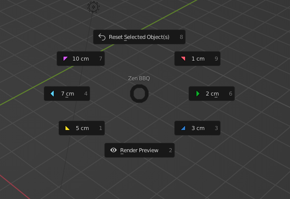
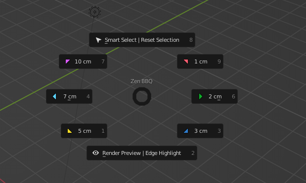

# Pie Menu

The Pie Menu is called with default hotkey **CTRL+SHIFT+X**.
 
It is intended to get access to the most used functions of the Zen BBQ add-on more quickly.

## Pie Menu in Object Mode

### Reset Selected Object(s)

Resets the selected objects to their default state, before Zen BBQ was used on them.
 Same as in [**N-panel**](npanel.md#5-reset-selection)

### Colored Triangles

Assign the corresponding bevel preset from the N-Panel to the selection, see [**Quick Start Guide**](quickstart.md#assign-bevel-with-pie-menu)

### Render Preview

Toggles Render Preview mode, see [**Quick Start Guide**](quickstart.md#previewing-the-result)

## Pie Menu in Mesh Edit Mode

### Smart Select | Reset Selection

- Just click: Smart Select, see [**Quick Start Guide**](quickstart.md#smart-select-with-pie-menu)
- Ctrl + click: Reset Selection, same as in [**N-panel**](npanel.md#5-reset-selection)

### Colored Triangles

Assign the corresponding bevel preset from the N-Panel to the selection, see [**Quick Start Guide**](quickstart.md#assign-bevel-with-pie-menu)

### Render Preview | Reset Selection

- Just click: Render Preview toggle, see [**Quick Start Guide**](quickstart.md#previewing-the-result)
- Ctrl + click: Highlight Bevels toggle, same as in [**N-panel**](npanel.md#1-toggle-highlight-bevels-onoff)

Zen Team reminds you that everyday usage of Zen Add-ons not only saves your time, but also charges your models in Blender for dollars, happiness, and long storage of vegetables!
<!-- Also, you can [**watch the video**](https://youtu.be/dqpgWcRBE4o?t=17) how to install it. -->

