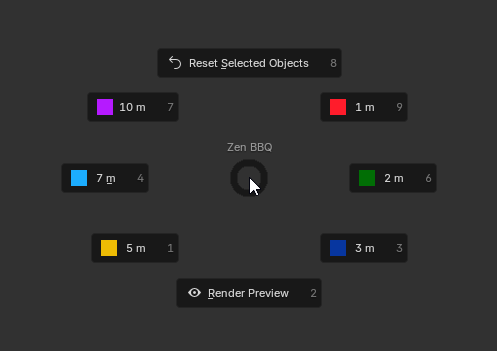
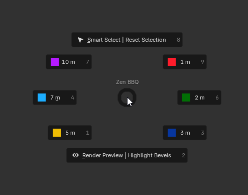

# Pie Menu

The Pie Menu is called with the default hotkey **Ctrl + Shift + X**.

It is designed to give you incredibly fast access to the most frequently used functions of the Zen BBQ addon directly in the viewport.

---

## Pie Menu in Object Mode

|  |
|:---:|
| *Fig. 1. Zen BBQ Pie Menu options available in Object Mode.* |

### Reset Selected Object(s)

Resets the selected objects to their default state, before Zen BBQ was used on them.
 Same as in the [**N-Panel**](subpanel_bevels.md/#tools-block).

### Colored Squares

Assign the corresponding bevel preset from the N-Panel to the selection. For more details, see the [**Quick Start Guide**](quickstart.md#assign-bevel-with-pie-menu).

### Render Preview

Toggles the Render Preview mode, see [**Quick Start Guide**](quickstart.md#previewing-the-result).

---

## Pie Menu in Mesh Edit Mode

|  |
|:---:|
| *Fig. 2. Zen BBQ Pie Menu options available in Mesh Edit Mode.* |

### Smart Select | Reset Selection

* **Just click:** Executes **Smart Select** (see [**Quick Start Guide**](quickstart.md#smart-select-with-pie-menu)).
* **Ctrl + click:** Executes **Reset Selection** (same as in the [**N-Panel**](subpanel_bevels.md/#tools-block)).

### Colored Squares

Assign the corresponding bevel preset from the N-Panel to the selected geometry (edges or vertices). For more details, see the [**Quick Start Guide**](quickstart.md#assign-bevel-with-pie-menu).

### Render Preview | Reset Selection

* **Just click:** Toggles the **Render Preview** mode (see [**Quick Start Guide**](quickstart.md#previewing-the-result)).
* **Ctrl + click:** Toggles the **Highlight Bevels** overlay (same as in the [**N-Panel**](subpanel_bevels.md/#activating-the-overlay)).
