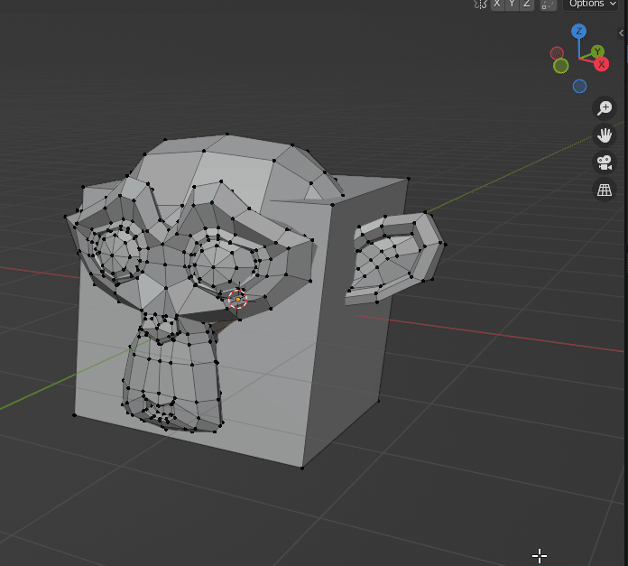
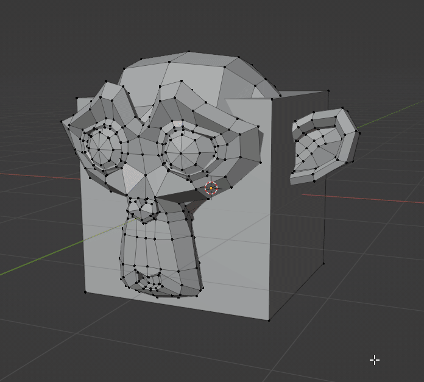
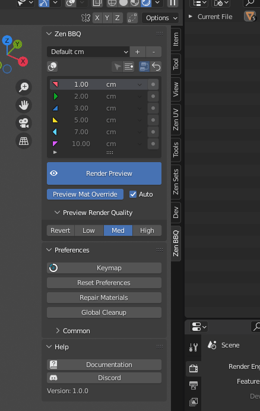
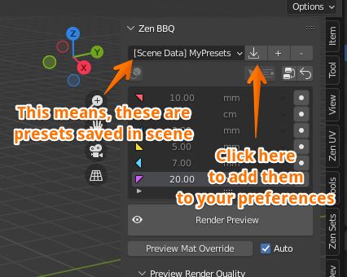
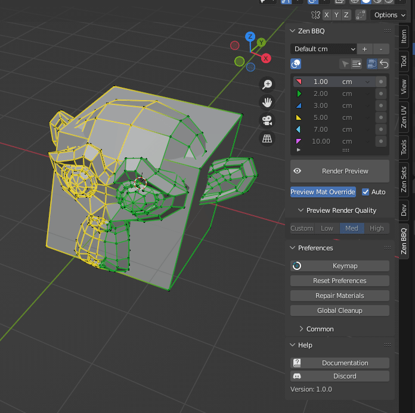
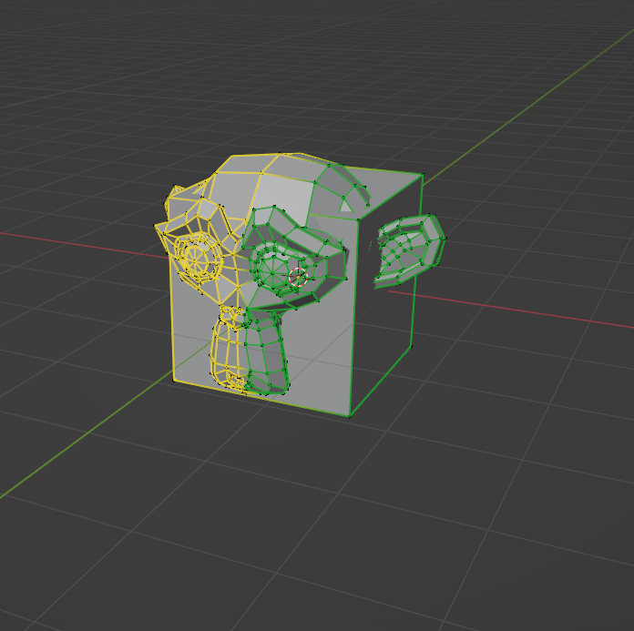
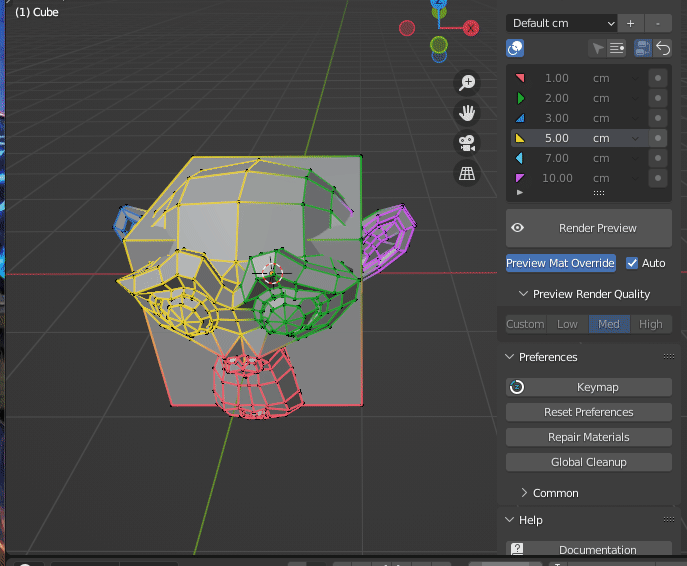

# Zen BBQ Quick Start Guide

<!-- blank line -->
<!-- 

<iframe width="1018" height="573" src="https://www.youtube.com/embed/iI1JWrOn2ys" title="YouTube video player" style="position: absolute; top: 0; left: 0; width: 100%; height: 100%;" allowfullscreen="" seamless="" frameborder="0"></iframe>

 -->
<!-- blank line -->
<!--
**Zen BBQ** is intended to create, tune and visually control bevel effect without actually changing geometry.

In contrast to traditional way, it does not require setting up supporting loops or accurately connect parts.

Instead, Zen BBQ uses Cycles render engine and Blender Bevel Shader Node to render the effect and its carefully crafted set of tools will give you full control over it with less effort.

It is great to make quick renders for sketches or bake basic normal maps for gamedev lowpoly models.

**Zen BBQ — Build Bevel Quickly!**
-->

**Zen BBQ** is intended to create, tune and visually control bevel effect without actually changing geometry.
## Main features:
- Assigning the desired bevel radius to the whole meshes or to their parts.
- Working with multiple objects in Edit Mode at once.
- Highly-adjustable list of presets. You can use the buit-in, edit them or create your own. Both Metric and Imperial unit systems are supported.
- Edge highlight system that allows you to see which settings are assigned to different parts of the mesh withour having to render it.
- Quick render preview tools that allow you to preview your result in two clicks and revert it back
- Quick and non-destructive adding and removing the bevel node to the existing materials
- Pie Menu with the most frequently used operators

## Assigning Bevel to the Selection

### Assign bevel with N-Panel

- Make sure that you have something selected in Object Mode or Edit Mesh Mode
- In View3D view, open the Tools panel at the right part of the area (Default hotkey: "N")
- Open the Zen BBQ panel tab
- Click the "●" button right to the desired bevel radius
- Bevel will be assigned. If you are in Edit Mode, edge highlight will also be activated.

### Assign bevel with Pie Menu

- Make sure that you have something selected in Object Mode or Edit Mesh Mode
- In View3D view, call the Pie Menu by hitting the hotkey (Default: "SHIFT+CTRL+X")
- Choose one of the desired bevel values.
- Bevel will be assigned. If you are in Edit Mode, edge highlight will also be activated.

## Previewing the result

- In Zen BBQ Panel, click the large "Render Preview" button.
- It is required to switch the render engine to Cycles, if it was not done before. Click OK.
- **See the result!**
- You can toggle the Render Preview mode by clicking the same button.
- In Preview Render Quality Block you can choose the desired settings. Revert button reverts to the saved user's settings.
- Preview Mat Override button overrides the current material of the selected objects to see bevel more clearly. You can toggle it by clicking this button.
- "Auto" checkbox set on means that Preview Mat Override is toggled synchronously with Render Preview.
- You can toggle on/off the Edge Highlighting by clicking the corresponding button in Zen BBQ Panel (currently available in Edit Mesh Mode only)

## Managing Presets

- You can choose one of the buit-in preset groups in the dropdown menu. Each preset group contains six presets, they are correspondingly shown in the Pie Menu. Edge highlighting also uses colors corresponding to the currently selected preset group. 
- By default there are groups for centimeters, millimeters, meters and inches. You can edit the default presets by clicking on them in the list and choosing the desired value or unit.
- You can create your own preset groups by clicking "+" button. It will ask the name of the new group and the desired units, but you can change units later. It is not required to have the same units in list, you can mix it, for example, having millimeters and centimeters in one list.
- You can delete bevel preset group by clicking "-" button.
- You can reset it to the default state by clicking "Reset Preferences" in "Preferences" panel. Warning, it will also reset all other settings to the defaults.

- If the scene contains bevel preset group that is not in your list, it will be marked as "[Scene Data]" and "Import" button will appear. By clicking it, you can save this preset group into your preferences for further usage.

## Selection by Bevel

### Smart Select

#### Smart Select with N-Panel

- Make sure you're in Edit Mode with a mesh object and have something selected.
- Hit the "Smart Select" button on the Zen BBQ Panel.
- Corresponding geometry will be selected.
- Options panel allows you to adjust smart selection threshold (in 99% cases, the default value is fine)

#### Smart Select with Pie Menu

- Make sure you're in Edit Mode with a mesh object and have something selected.
- In View3D view, call the Pie Menu by hitting the shortcut (Default: "SHIFT+CTRL+X").
- Choose the "Smart Select" option at the top.
- Corresponding geometry will be selected.

### Select by Preset

- Make sure you're in Edit Mode with a mesh object.
- Select the preset you want to select with in the list.
- Click the "Select by Bevel Preset" button.
- Corresponding geometry will be selected
- Options panel allows you to adjust accuracy and use "Add to selection" mode. With this checkbox on, the previously selected geometry will remain selected.

**Enjoy this experience with us!**

 [**Gumroad**](https://sergeytyapkin.gumroad.com/l/zenbbq) |  [**BlenderMarket**](https://www.blendermarket.com/products/zen-bbq) |  [**Discord**](https://discord.gg/wGpFeME)

<!-- blank line -->
----
<!-- blank line -->
