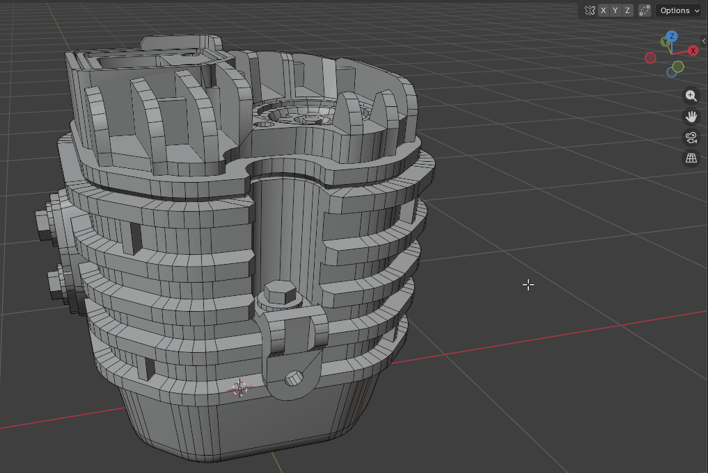
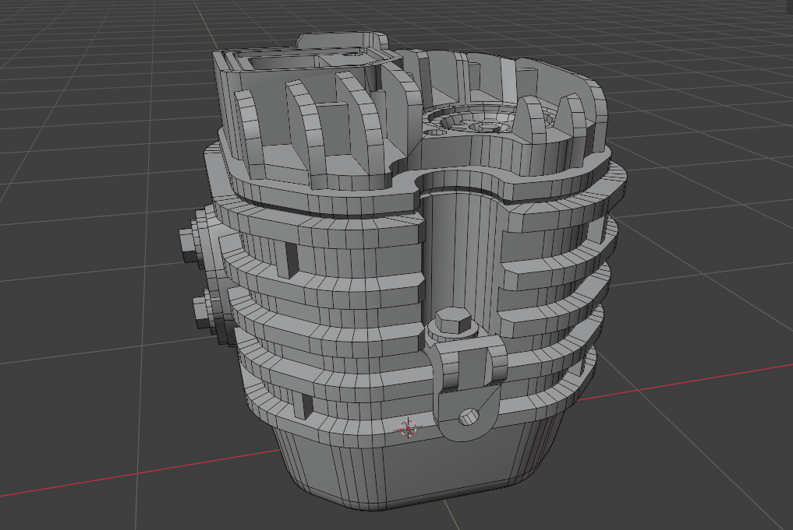
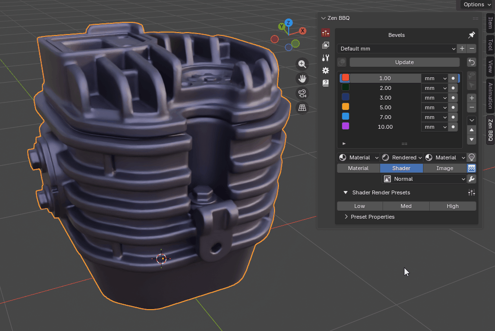
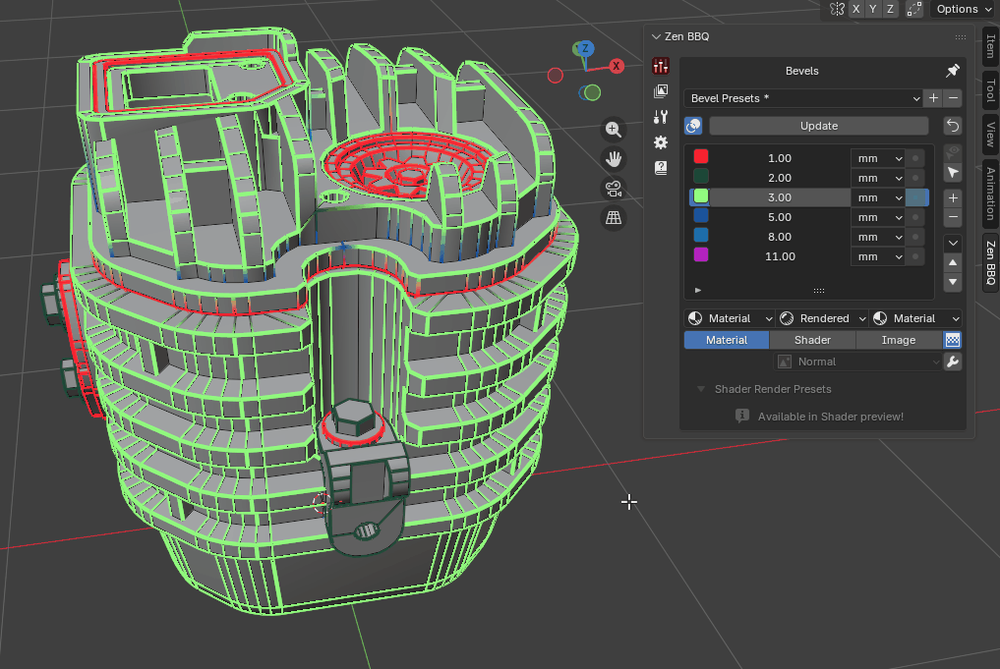
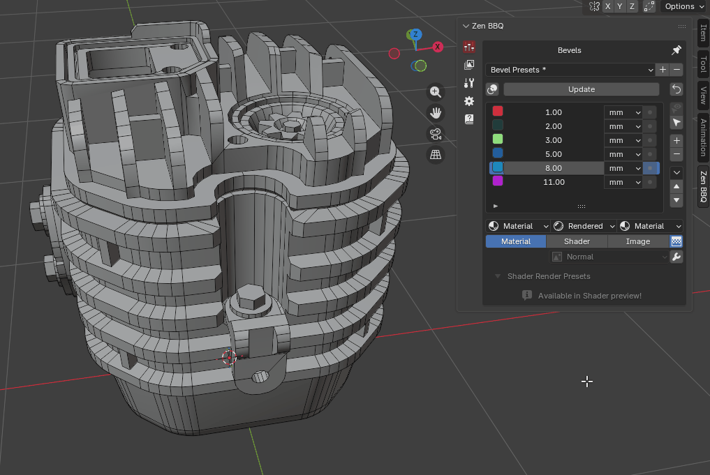

# Zen BBQ Quick Start Guide

**Zen BBQ** is intended for creating, adjusting visualizing and baking bevels without actually changing geometry.

## Assigning Bevel to the Selection

### Assign bevel with N-Panel

* Make sure you have an object selected in either **Object Mode** or **Edit Mode**.
* In the 3D Viewport, open the **Sidebar** (N-Panel) on the right side of the screen (Default hotkey: **N**).
* Open the **Zen BBQ** tab.
* (Optional) Enable the bevel color overlay using the **Highlight Bevels Toggle** button (represented by the Intersecting Circles icon) located inside the Tools Block, directly above the preset list.
* Click the **"●"** button **to the right of** your desired bevel radius.
* The bevel will be assigned. If you are in **Edit Mode**, the bevel weight is applied only to the **selected edges**. If you are in **Object Mode**, the bevel is assigned to **all edges** of the object.

|  |
|:---:|
| *Fig. 1. Assign Bevel with N-Panel* |

### Assign bevel with Pie Menu

* Make sure you have an object selected in either **Object Mode** or **Edit Mode**.
* (Optional) Enable the bevel color overlay using the **Highlight Bevels Toggle** button as described in the steps above.
* In the 3D Viewport, summon the **Pie Menu** by pressing the global hotkey (Default: **Ctrl + Shift + X**).
* Select your desired bevel value from the wheel.
* The bevel will be assigned. If you are in **Edit Mode**, the bevel weight is applied only to the **selected edges**. If you are in **Object Mode**, the bevel is assigned to **all edges** of the object.

|  |
|:---:|
| *Fig. 2. Assign Bevel with Pie Menu* |

## Previewing the result

* Once bevels are assigned, go to the **Zen BBQ --- Bevels Panel** and click the **Shader** button.
* **See the result!**
* If your model appears too dark, click the **Use Scene World** button on the far right of the row next to the **Shader** button.
* In the **Shader Render Preset** block, you can choose the desired preview quality by clicking the **Low**, **Med**, or **High** buttons.

|  |
|:---:|
| *Fig. 3. Previewing the result* |

## Managing Presets

* **Preset Groups:** You can select any built-in preset group from the dropdown menu. Each group contains six distinct presets that correspond directly to the slots in the **Pie Menu (Ctrl + Shift + X)**. Additionally, the **Highlight Bevels** function utilizes color overlays that match the active preset group.
* **Default Groups:** By default, Zen BBQ provides pre-configured groups for centimeters, millimeters, meters, and inches. You can modify any default preset at any time by clicking its value in the list and inputting your desired size or unit.
* **Creating Custom Groups:** To create a new preset group, click the **Plus (+)** button. A prompt will appear asking you to specify the group name and primary unit. You can change these units later; Zen BBQ supports mixed units within a single group (e.g., combining millimeters and centimeters in the same list).
* **Deleting Groups:** To remove the currently active preset group, click the **Minus (-)** button.
* **Resetting Preses:** If you need to restore all preset groups to their original factory values, navigate to the **Preferences** panel and click **Reset Preferences**.

!!! warning
    Clicking *Reset Preferences* will restore all preset groups to their default states and will also reset all other custom addon configurations.

|  |
|:---:|
| *Fig. 4. Managing Presets* |

## Selection by Bevel

### Smart Select

* Make sure you are in **Edit Mode** with a mesh object.
* Select an edge with your desired bevel radius.
* Click the **Smart Select** button (represented by the Arrow with an Eye icon) in the **Zen BBQ --- Bevels Panel**.
* All edges sharing the same bevel value will automatically be selected.
* Use Blender's Operator Options panel at the bottom-left of the screen to adjust the selection threshold/tolerance.

|  |
|:---:|
| *Fig. 5. Smart Select* |

#### Select by Preset

* Make sure you are in **Edit Mode** with a mesh object.
* Select the desired preset from the list in the **Zen BBQ --- Bevels Panel**.
* Click the **Select by Bevel Preset** button (located next to the preset list).
* All edges assigned to the selected preset will be selected.
* Use Blender's Operator Options panel to fine-tune the selection accuracy or enable **Add to selection** mode. When this option is enabled, your previously selected geometry will remain selected alongside the new selection.

|  |
|:---:|
| *Fig. 6. Select by Preset* |

## Baking

* Select your mesh object.
* Ensure that the bevels are assigned as described in the steps above. You can switch to the **Shader** preview mode to verify that the procedural bevels look correct on your model. 
* Make sure your mesh has a proper **UV Map**.
* Open the **Zen BBQ --- Bake Panel**.
* Expand the **Bake Render Presets** section located at the bottom of the **Bake Panel**.
* Select your desired baking quality profile by clicking the **Low**, **Med**, or **High** buttons.
* Click the **Start Bake** button (represented by the Play icon) located directly below the object list in the **Bake Panel** and wait for the process to complete.
* Return to the **Bevels Panel**.
* Click the **Image** preview button to switch the viewport display mode.
* **See the result!** Your baked texture maps are now displayed directly on the model.

|  |
|:---:|
| *Fig. 7. Baking* |

**Enjoy this experience with us!**

 [**Gumroad**](https://sergeytyapkin.gumroad.com/l/zenbbq) |  [**Superhive**](https://superhivemarket.com/products/zen-bbq) |  [**Discord**](https://discord.gg/wGpFeME)

<!-- blank line -->
----
<!-- blank line -->
