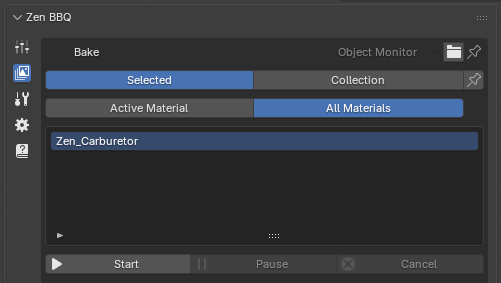
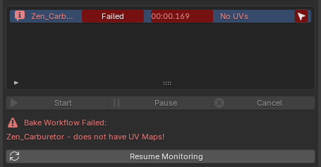
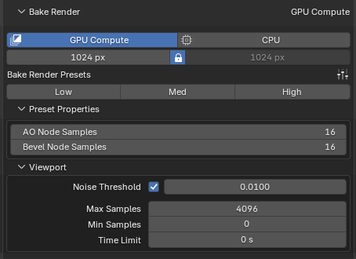
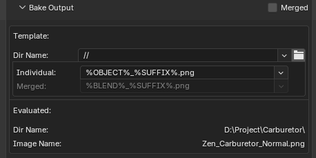
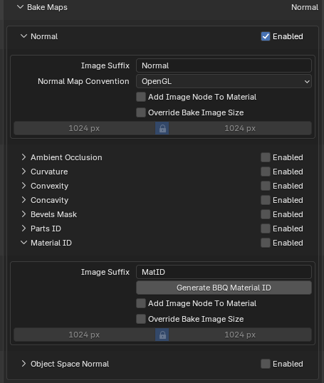
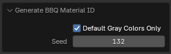
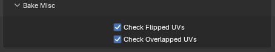

# Bake Panel

The **Bake** subpanel provides a complete, streamlined environment for configuring and baking texture maps (such as Normal, AO, and Curvature) directly inside Blender. It integrates object management, rendering engine settings, quality presets, and file output path templates into a single vertical layout.

|  |
|:---:|
| *Fig. 1. Overview of the Bake panel and its target management systems.* |

---

## 1. Target & Object Selection Mode

At the very top, you control exactly which objects and materials are queued for the baking process:

* **Selected vs. Collection:** * `Selected` (Default): Bakes maps only for the objects currently selected in the viewport.
    * `Collection`: Bakes all objects contained within a designated Blender Collection.
* **The Pin Button (Freeze Selection):** Located next to the Selection mode switch, this button locks the current target group. Once **Pinned**, Zen BBQ stops tracking viewport selection changes entirely. The system freezes the current list of objects inside the monitor, ensuring you don't accidentally drop your bake queue by clicking empty space in the viewport.
* **Active Material vs. All Materials:**
    * `Active Material`: Bakes maps only for the material currently active on the object.
    * `All Materials`: Batch-bakes every material slot assigned across the target geometry.

---

## 2. Object Monitor & Error Diagnostics Log

The **Object Monitor** serves as both your pre-bake checklist and a post-bake diagnostic logging center. 

|  |
|:---:|
| *Fig. 2. The Object Monitor in Log Display mode showing a critical UV error and the execution report.* |s

During the bake configuration, it simply displays a clean list of targeted objects (e.g., `Zen_Carburetor`). However, once the baking process finishes or encounters an issue, the monitor automatically switches into **Log Display Mode**:

### Diagnostic Features & Error Tracking

* **Visual Status Reports:** Each object row updates with a status tag (e.g., `Failed`), the exact calculation time (`00:00.169`), and a short error summary (`No UVs`).
* **Detailed Error Notice:** Underneath the control buttons, a dedicated warning section prints the specific reason for the failure (e.g., `Zen_Carburetor - does not have UV Maps!`). 
* **Target Selector (Arrow icon):** A convenient navigation arrow appears on the far right of the object's row. Clicking it immediately selects that specific object in the Blender scene so you can fix the issue without searching for it manually.

To keep the UI clean, Zen BBQ evaluates and displays **only one critical error per object at a time**. The engine actively monitors the following pipeline requirements:

1. **Bevel Data Check:** Verifies if custom bevel data or weights are actually assigned to the object.
2. **Active UV Map:** Checks if the target object has a valid, active UV layout.
3. **Flipped UV Islands:** Detects if any UV islands are flipped (have inverted normals/face orientation), which would cause inverted baking results.
4. **UV Overlaps:** Scans for overlapping islands that might cause texture blending artifacts during the baking process.

### Returning to Workflow

* **Resume Monitoring Button:** When the system is in Log Display Mode, the monitoring engine pauses. Click the **Resume Monitoring** button at the bottom to clear the diagnostic log, exit the error report, and return to live tracking of your viewport selection.

---

## 2. Bake Controls & Engine Configuration

|  |
|:---:|
| *Fig. 3. Bake Controls & Engine Configuration.* |

Directly beneath the object monitor lies the execution center:

* **Process Control:** Features `Start`, `Pause`, and `Cancel` buttons to manage active baking processes in real-time.
* **Bake Render Target:** Toggles between `GPU Compute` and `CPU`. It is highly recommended to use GPU Compute for faster processing if your hardware supports it.
* **Resolution Control:** Sets the horizontal and vertical resolution of the output texture maps (e.g., `1024 px`). The **Lock** icon ensures that width and height remain perfectly square (1:1 ratio) when adjusting sizes.

---

## 3. Bake Render Presets & Sampling

Similar to the [viewport engine](subpanel_bevels.md#shader-render-presets), Zen BBQ provides specialized quality profiles specifically tuned for baking. These profiles dictate the Cycles render sampling settings and **directly determine the final texture crispness**:

* **Low / Med / High Toggles:** Quickly swaps core parameters based on whether you need a fast test bake or production-ready maps.
* **Preset Properties (AO & Bevel Node Samples):** Sets the physical render sample rates inside the shader networks to ensure transitions look perfectly smooth without grain.
* **Cycles Viewport/Render Sampling integration:** Exposes the underlying `Noise Threshold`, `Max Samples`, `Min Samples`, and `Time Limit` bounds so you can balance bake times and noise suppression perfectly.

---

## Bake Output & File Naming Templates

|  |
|:---:|
| *Fig. 4. Bake Output & File Naming Templates.* |

This block automates the saving of textures and matches them to your asset naming conventions:

* **Merged Checkbox:** When enabled, this option combines and bakes maps from **multiple selected objects into a single, shared texture map**. 
    * ⚠️ **Critical Requirement:** For this mode to work correctly, the UV maps of all included objects must be unwrapped and packed together into the same UV space layout (without overlapping each other) so their textures don't overwrite one another.
* **Dir Name (`//`):** Sets the destination folder path. By default, it uses Blender's relative path format (`//`), saving images next to your project `.blend` file. Clicking the folder icon lets you set a custom path.
* **Naming Tokens (Individual / Merged):** Uses dynamic string variables to auto-generate clean filenames.
    * `%OBJECT%_%SUFFIX%.png`: Translates automatically to the object's name combined with the individual **Image Suffix** defined inside that specific map's subpanel (e.g., `Zen_Carburetor_Normal.png` or `Zen_Carburetor_AO.png`).
* **Evaluated Paths:** Underneath the templates, Zen BBQ shows a live preview of the real system path and exact file names that will be generated. This eliminates guesswork entirely.

---

## Bake Maps Settings (Per-Map Configuration)

|  |
|:---:|
| *Fig. 5. Bake Maps Settings.* |

The **Bake Maps** section allows you to activate specific bake layers via the **Enabled** checkbox on the right side of each row. Expanding a map type dropdown reveals advanced options specific to that layer.

### Common Parameters

Almost every map subpanel shares these two powerful workflow settings:
* **Add Image Node To Material:** When enabled, the addon automatically injects a standard `Image Texture` node containing the freshly baked map into the object's material node tree. It is placed directly to the right of the `Shader Output` node, leaving it completely up to the user how to route and utilize the baked texture.
* **Override Bake Image Size:** Allows you to override the global resolution (set in the main Bake panel) for this specific map type. When checked, you can manually set a custom resolution (e.g., baking a 4K Normal Map while keeping auxiliary masks at 1024px).

---

### Map-Specific Settings

### 1. Normal

* **Image Suffix:** The text appended to the filename when using the `%SUFFIX%` token (Default: `Normal`).
* **Normal Map Convention (OpenGL / DirectX):** Controls the direction of the green channel ($Y$-axis). Swapping between conventions instantly inverts the channel to ensure compatibility with your target game engine (e.g., Unreal Engine or Unity).

### 2. Ambient Occlusion / Curvature / Convexity / Concavity

* **AO / Cavity Distance:** Defines the maximum ray-cast distance used to calculate the specific surface details or shadow occlusions.
* **Disable Explode in Renders:** Zen BBQ includes a procedural `Explode` modifier (accessible via the Tools panel) to separate intersecting meshes and avoid dark projection artifacts during baking. Checking this box temporarily disables the Explode modifier during the render calculation for these specific maps if your workflow requires it.

### 3. Bevels Mask & Parts ID & Object Space Normal

* Provides standard options to customize the **Image Suffix**, override sizes, and automatically add the baked node back into the material tree.

### 4. Material ID

|  |
|:---:|
| *Fig. 6. Generate BBQ Material ID operator properties.* |

* **Generate BBQ Material ID:** (See **Fig. 5** above) Automatically generates random, highly distinct viewport colors for all materials assigned to the selected objects. 
* **Why this is needed:** By default, Blender assigns a flat gray color to the `Viewport Display -> Color` property of new materials. Since Zen BBQ utilizes these exact viewport colors to generate and bake the Material ID pass, having multiple identical gray materials will result in a broken, merged ID map.
* **Smart Filtering:** The operator is non-destructive—it targets and replaces only the default, unedited gray colors, fully preserving any custom viewport colors you have already manually configured.
  
## Bake Misc (Performance & Verification Settings)

At the very bottom of the Bake interface, you will find the **Bake Misc** subpanel. This panel contains global toggles for the automatic geometry and UV diagnostics.

|  |
|:---:|
| *Fig. 7. Global diagnostic toggles under the Bake Misc panel.* |

* **Check Flipped UVs** (Checked by default)
* **Check Overlapped UVs** (Checked by default)

### Performance & Workflow Impact
* **Why turn them off?** Scanning complex meshes with massive polycounts or dense UV sets for overlapping or flipped islands can introduce a slight computational overhead. If you are confident in your UV layout and want to squeeze out maximum baking performance, you can optionally uncheck these options to speed up the pre-bake pipeline initialization.
* **Non-Blocking Warnings:** It is important to note that **these checks never halt or interrupt the baking process**. If Zen BBQ detects flipped or overlapping UVs while these options are active, it will continue baking your maps uninterrupted. The errors will simply be printed as non-blocking diagnostic warnings in the **Object Monitor Log** upon completion, allowing you to review the quality report post-render.

---

[ **Gumroad**](https://sergeytyapkin.gumroad.com/l/zenbbq) | [ **Superhive**](https://blendermarket.com/products/zen-bbq) | [ **Discord**](https://discord.gg/wGpFeME)