# Bevels

The **Bevels** subpanel features a dedicated preset list for selecting and assigning bevel sizes, management for preset groups, and a toggle to control how your objects are visualized in the Blender viewport.

---

## Bevel Presets List

| 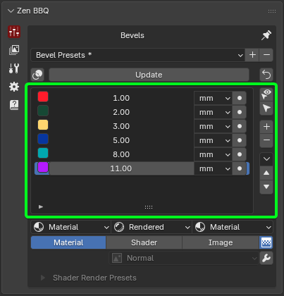 |
|:---:|
| *Fig. 1. Main Panel Presets List* |

This list contains your custom bevel size presets. Each row represents an individual preset and includes the following elements:

- **Color Tag:** Used for visual identification of the bevel size in the viewport and within the [Zen BBQ Pie Menu](piemenu.md).
- **Size Value:** The numerical radius of the bevel.
- **Unit Dropdown:** Displays and controls the unit of measurement for the bevel.
- **Assign Operator:** A direct button to apply the specific bevel size to the selected mesh elements. Having this operator available for each row allows you to assign a bevel instantly with a single click, without needing to select the list item first.

To the right of the list, you will find list management buttons and auxiliary operators:

- **Smart Select:** Selects geometry (vertices/edges) that shares the same Bevel Value as the currently selected elements, using a specified threshold. *Requires the object to be in Edit Mode with at least one mesh element selected.*
- **Select by Selected Preset:** Selects all geometry in the mesh that matches the Bevel Value of the active preset in the list.
- **Add Entry (+):** Adds a new bevel preset to the list.
- **Remove Entry (-):** Removes the active bevel preset from the list.

### Advanced Operators

The drop-down arrow button contains advanced operators that are used less frequently:

| 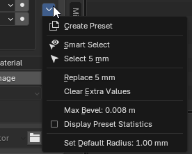 |
|:---:|
| *Fig. 2. Advanced Operators* |

- **Create Presets:** Generates a standard set of 6 bevel values tailored to your current scene units. This is an excellent starting point when setting up a new project from scratch.
- **Replace Radius Value:** Replaces an existing radius value across the entire mesh with a newly specified one.
- **Clear Extra Values:** Purges all custom bevel values from the mesh geometry that are no longer present in your active preset list.
- **Update:** Refreshes and recalculates the Zen BBQ bevel data.
- **Display Preset Statistics:** Toggles statistical data. Once enabled, a counter will appear next to each preset row, showing the exact number of vertices/edges where this specific bevel value is applied.
- **Set Live Boolean Default Bevel:** Changes the default live boolean bevel radius for the selected objects. For a deep dive into this workflow, see the [Live Boolean](live_boolean.md) guide.

Please see the [**Quick Start Guide**](quickstart.md#managing-presets) for step-by-step instructions.

### Color Tag

Each preset features a dedicated **Color Tag** used to visually identify specific bevel radiuses in the viewport. These six presets are also automatically mapped to the [Pie Menu](piemenu.md) in a clockwise direction.

| 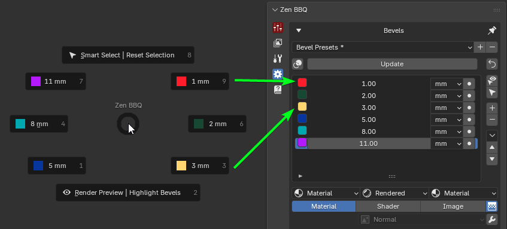 |
|:---:|
| *Fig. 3. Pie menu correspondence.* |

#### Activating the Overlay

To visualize these color tags on your geometry, you need to enable the overlay mode using the dedicated control button:

| 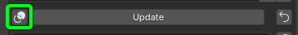 |
|:---:|
| *Fig. 4. Highlight Bevels Toggle operator location.* |

* **Highlight Bevels Toggle (Intersecting Circles icon):** Located inside the **Tools Block**, directly above the preset list (first icon in the row next to the Update button). Toggling this on activates the real-time viewport overlay, color-coding edges based on their assigned bevel radius.

| 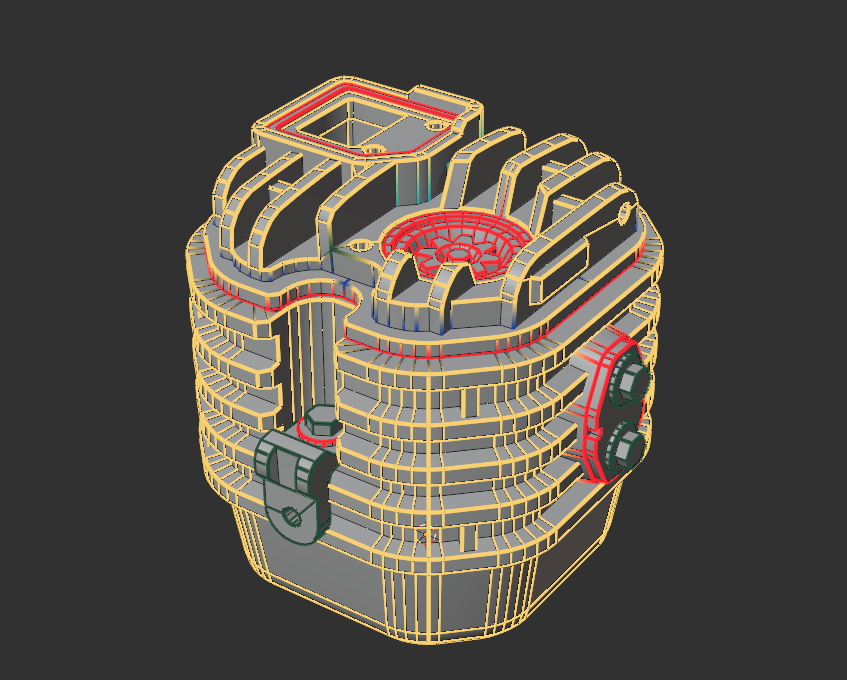 |
|:---:|
| *Fig. 5. Color Tag implementation in the viewport and preset list.* |

---

## Preset Group Selection

| 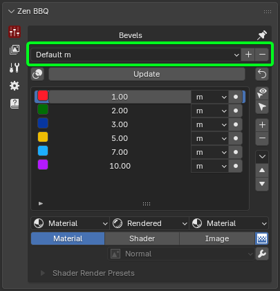 |
|:---:|
| *Fig. 6. Main panel preset group selection* |

This section utilizes Blender's native preset system to create, save, and manage custom groups of your bevel size lists.

From left to right:

- **Preset Dropdown:** Displays the active preset group name and lets you switch between saved groups.
- **Add Button (+):** Saves the current state of your bevel size list as a new preset group.
- **Remove Button (-):** Deletes the currently selected preset group from the list.

Please see the [**Quick Start Guide**](quickstart.md#managing-presets) for step-by-step instructions.

---

## Tools Block

| 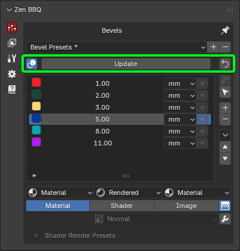 |
|:---:|
| *Fig. 7. Main panel tools block* |

From left to right:

- **Highlight Bevels Toggle:** Toggles the color-coded bevel visualization for objects in Edit Mode on or off. While it doesn't display the physical size, it allows you to easily identify specific bevel sizes by their corresponding [Color Tags](#color-tag) defined in the presets list.
- **Update:** Refreshes the Zen BBQ bevel data. This synchronizes the state of the active preset list with the actual data stored inside the scene objects. It is highly recommended to run this update when opening a project file received from a colleague.
- **Set Zero Radius to Selection:** Applies a zero-bevel radius to the selected geometry. This operator works in both **Object Mode** and **Edit Mode**, so exercise caution to avoid accidentally wiping your bevels. As a safeguard, this operator triggers a confirmation popup before executing.
  
---

## Viewport Display Engine

The Viewport Display Engine is a powerful toolset within Zen BBQ designed to manage how your objects and bevels are visualized in the Blender viewport. It allows you to quickly cycle through different preview modes to inspect your procedural bevels, baked maps, or original materials.

| 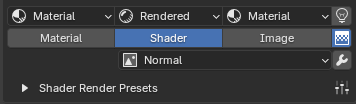 |
|:---:|
| *Fig. 8. The main Viewport Display switcher and its configuration subpanels.* |

### Core Logic & How It Works

The engine operates using **three main display modes** represented by a row of buttons (only one mode can be active at a time).

!!! Note
  To switch modes, **at least one object must be selected**. This requirement exists because Zen BBQ utilizes a non-destructive material overriding system. Instead of permanently altering your custom shader networks, the addon injects a specialized group of nodes directly before the **Shader Output** node of the selected object's material. 

This override group can be toggled automatically by switching modes, or cleared manually at any time.

---

### Display Modes

| 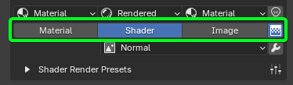 |
|:---:|
| *Fig. 9. Material, Shader, and Image display mode buttons with the active Map Type dropdown.* |

| 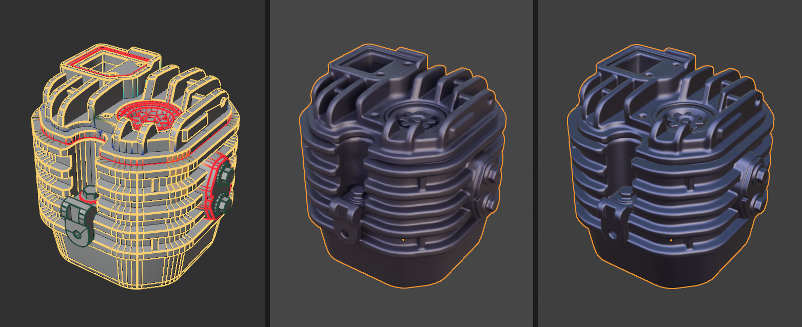 |
|:---:|
| *Fig. 10. Material (with active BBQ overlay), Shader, and Image display mode comparision from left to right.* |

#### 1. Material Mode

This mode displays your original, unaltered user materials. It is designed for checking the final look of your asset without any diagnostic overlays.

#### 2. Shader Mode

This mode activates the procedural shader override to visualize bevels and other procedural diagnostic maps directly on the object's surface. When active, you can select the specific map type from the dropdown menu below the buttons:

* **Normal:** Displays the procedural bevels seamlessly integrated into a clean clay-like material (optimized to judge surface transitions, rather than showing a raw normal map texture).
* **AO** (Ambient Occlusion)
* **Curvature**
* **Convexity**
* **Concavity**
* **Bevels Mask**
* **Parts ID**
* **Materials ID**
* **Object Space Normal Map**

#### 3. Image Mode

This mode is used to visualize **baked texture maps**. It features the exact same map type options as Shader Mode, but instead of calculating them procedurally in real-time, it reads the data directly from the baked image textures. This is ideal for verifying baking quality before exporting your asset.

---

### Shading Type & Shading Lock Settings

Directly above each mode button sits its corresponding configuration popover. Clicking it opens a subpanel where you can manage the Blender **Shading Type** (Rendered, Material, Solid, Wireframe, or Skip) and color settings.

| 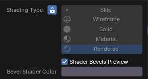 |
|:---:|
| *Fig. 11. Shading Type and Lock configuration popup for the Shader Mode.* |

#### The Lock Icon (Shading Lock)
Each popover features a **Lock** toggle next to the Shading Type selection. When locked, it forces the Blender viewport into that specific shading mode and prevents accidental manual changes, preserving the core workflow.

* By default, the lock is **enabled** for both **Shader** and **Image** modes. This ensures that procedural bevels and baked maps remain visible, as they require specific viewport shading types to render correctly.
* Advanced users can unlock these settings or choose the **Skip** option, which completely bypasses viewport shading changes when switching modes.

---

### UI Color Coding and Material Assignments

Zen BBQ uses a strict color-coded system to give you instant visual feedback on your current engine state:

* ██ **Eggplant Color (#5C5668FF):** The default material color used for **Shader Mode**. It provides an optimized, neutral matte surface for inspecting real-time procedural bevels.
* ██ **Blue-Gray Color (#585878FF):** The default **Bake Preview Color** used for **Image Mode**. It shares a similar tone to the Shader Mode for easy comparison, but leans slightly bluer to match the standard look of a Normal Map.
* ██ **Default Material Color (#4F6058FF):** Because the engine relies on materials to preview bevels, Zen BBQ will automatically assign a temporary fallback material if your object doesn't have one. You can customize this fallback color in the [Preferences -> Common](subpanel_preferences.md#common-settings) panel.

#### Advanced Shader Setting: Shader Bevels Preview
Within the **Shader** popover, you will find the **Shader Bevels Preview** checkbox. 

* **Checked (Default):** Injects the standard override node group to preview bevels and procedural maps.
* **Unchecked:** Disables the automatic override. This is an advanced workflow setting utilized when authoring custom normal manually with the **Zen BBQ Normal Mixer**, preventing the default diagnostic shader from interfering with your custom setup.

---

## Shader Render Presets

Directly below the display mode buttons, you will find the **Shader Render Presets** subpanel. These settings control the viewport rendering quality for procedural previews. They drastically speed up performance in the viewport and **do not affect the final baking quality**, which utilizes a separate, dedicated configuration.

| 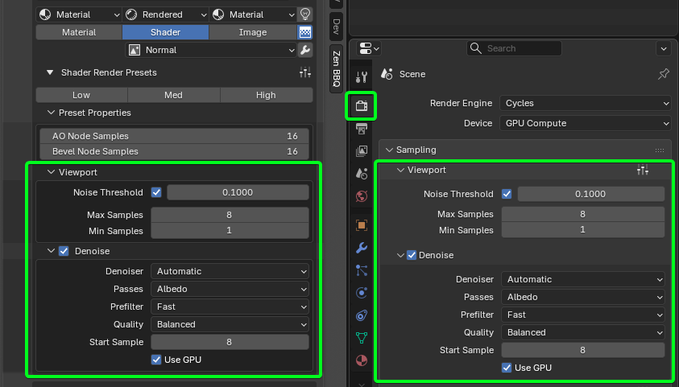 |
|:---:|
| *Fig. 12. Zen BBQ Render Presets linked directly with Blender's native Viewport settings.* |

### Quick Quality Toggles

To keep your workflow fluid, Zen BBQ comes with three out-of-the-box quality presets:

| 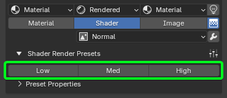 |
|:---:|
| *Fig. 13. Quick quality toggles section with Low, Med, and High preset profiles.* |

* **Low:** Optimized for maximum viewport responsiveness during fast asset iteration.
* **Med:** A balanced profile offering a clean preview with minimal performance impact.
* **High:** Delivers maximum visual fidelity to inspect fine bevel intersections before baking.

Advanced users can customize and save their own profiles using Blender's native preset system by clicking the **Preset Management** button (sliders icon) located on the right side of the subpanel header.

### Preset Properties & Blender Integration

As demonstrated in *Fig. 12*, the settings inside the **Viewport** and **Denoise** sections are bi-directionally synced with Blender's native **Render Properties -> Sampling -> Viewport** panel. Changing values inside Zen BBQ updates Blender instantly (and vice versa), giving you full transparency over what the addon is controlling.

Key parameters managed by the presets include:

* **AO & Bevel Node Samples:** Specifically regulates the sample counts inside the procedural Cycles shader nodes to clean up noise on transitions.
* **Noise Threshold & Max/Min Samples:** Manages the core Cycles viewport render engine limits.
* **Denoise Settings:** Toggles viewport denoising (`Automatic`, `OptiX`, etc.) and configures the start sample threshold to let you clean up complex preview shapes instantly.

### Auxiliary Viewport Controls

To the right of the display mode switcher buttons, there are additional quick-access diagnostic icons to help you manage lighting, image filtering, and shader health.

| 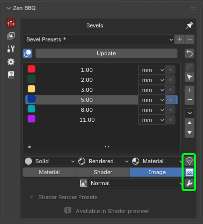 |
|:---:|
  *Fig. 14. Scene World (Light bulb), Texture Interpolation (Grid), and Repair Preview Nodes (Wrench) quick toggles.* |

* **Scene World (Light Bulb icon):** Toggles Blender's native `Use Scene World` shading property. 
  * **Why it matters:** By default, Blender uses the active scene world shader for lighting the viewport. If your world environment is empty or dark, inspecting procedural bevels becomes incredibly difficult. Disabling this option forces the viewport to bypass the scene world and use Blender's internal default HDRI lighting instead, which immediately provides a clear, well-lit surface for accurate previewing.
* **Texture Interpolation (Pixelated Grid icon):** Controls how the textures are scaled and filtered when viewing them in **Image Mode**.
  * **Enabled (Linear):** Uses standard linear filtering for a regular, smooth render interpolation quality.
  * **Disabled (Closest):** Disables interpolation entirely, displaying raw pixels based on the nearest pixel method (ideal for pixel-art styles and evaluating texture **texel density**).
* **Repair Preview Nodes (Wrench icon):** Purges all cached preview nodes from the active materials and regenerates them from scratch. 
  * **Why it matters:** This is a powerful maintenance tool used to resolve visual glitches or restore the underlying shader structure if Blender's node graph becomes desynced or corrupted during extensive manual material authoring.

!!! warning "Warning"
    Using **Repair Preview Nodes** will completely delete and regenerate all custom nodes created by Zen BBQ. If you have manually edited or customized any of these underlying shader node networks, all your changes will be permanently lost. Use this operator with caution!

---

[ **Gumroad**](https://sergeytyapkin.gumroad.com/l/zenbbq) | [ **Superhive**](https://blendermarket.com/products/zen-bbq) | [ **Discord**](https://discord.gg/wGpFeME)