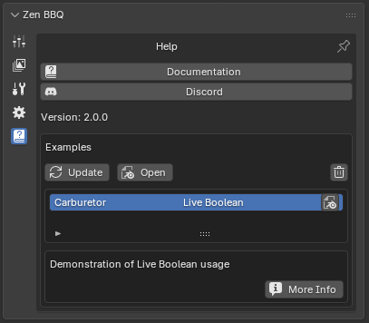
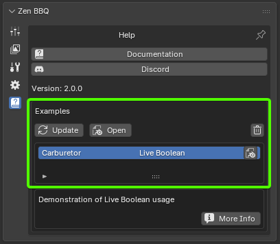

# Help & Examples

The Help panel provides direct access to resources, community platforms, and interactive demonstration scenes designed to help you quickly master Zen BBQ’s modeling and baking pipelines.

---

## Resources & Community

|  |
|:---:|
| *Fig. 1. Help panel interface featuring documentation, community links, and interactive examples.* |

* **Documentation:** Instantly opens the official web documentation in your default browser for quick reference on tools and workflows.
* **Discord:** Opens a link to join the active Zen Masters Discord community—the perfect place to get support, share feedback, and connect with other 3D artists.
* **Version:** Displays the currently installed version of Zen BBQ.

---

## Demonstration Examples

The **Examples** section allows you to browse, download, and explore pre-configured Blender scenes showcasing advanced techniques like Live Boolean workflows, correct UV setups, and material configurations.

|  |
|:---:|
| *Fig. 2. Interactive examples browser in the Help panel.* |

### Control Utilities

* **Update:** Connects to the server to download or refresh the list of available demonstration scenes, ensuring you always have access to the latest educational assets.
* **Open:** Downloads and loads the selected demonstration scene directly into your active Blender session.
* **Trash Bin (Delete):** Deletes the locally downloaded cache files of the selected demo scene from your disk to free up space.

### Scene List & Details

* **Interactive List:** Displays all available scenes. Click on any entry to view its description and details.
* **Blender Icon (Quick Open):** Located on the right side of the active scene row. Click this icon to open the downloaded `.blend` file immediately.
* **More Info:** Opens a web page with in-depth technical documentation and explanations for the selected example (e.g., detail break-downs of the Carburetor scene).