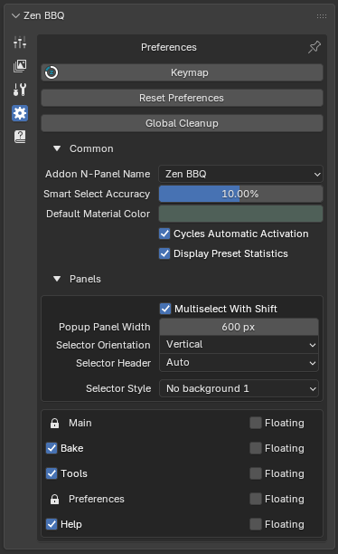
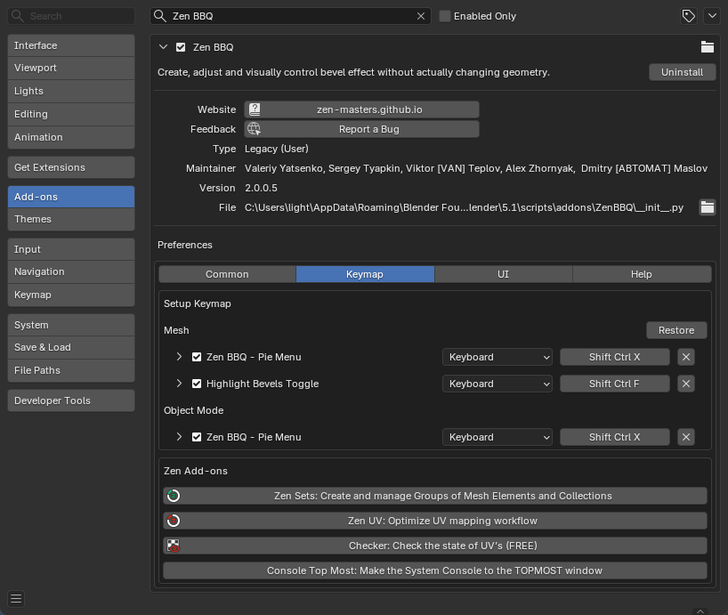
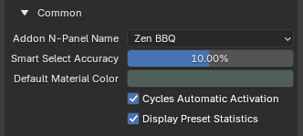
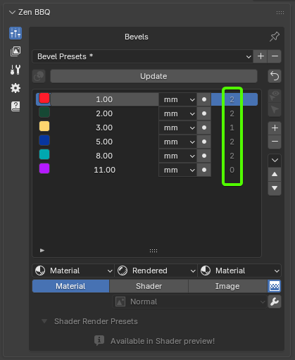
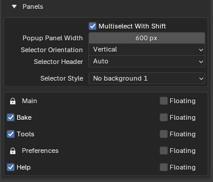
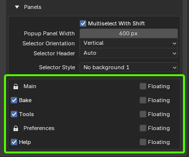

# Preferences

The Preferences panel allows you to customize hotkeys, UI styling, default values, and general behaviors to integrate Zen BBQ seamlessly into your custom modeling pipeline.

---

## System Actions

|  |
|:---:|
| *Fig. 1. Top-level configuration utilities in the Preferences tab.* |

* **Keymap:** Instantly opens Blender's Preferences window directly focused on the dedicated **Zen BBQ Keymap** configuration sub-tab. Here, you can easily customize, bind, or restore hotkeys for the **Zen BBQ Pie Menu** and **Highlight Bevels Toggle** across Edit Mesh and Object modes.

|  |
|:---:|
| *Fig. 2. Dedicated Zen BBQ Keymap customization panel in Blender Preferences.* |

* **Reset Preferences:** Reverts all Zen BBQ settings (including custom bevel width presets) back to their default "out-of-the-box" factory state.
* **Global Cleanup:** Executes a deep scene-wide purge of all Zen BBQ-related data. This completely removes dynamic materials, shader graphs, and custom edge/vertex attributes from every mesh in your active blend file.

---

## Common Settings

|  |
|:---:|
| *Fig. 3. Common global configuration options in Zen BBQ.* |

* **Addon N-Panel Name:** Allows you to customize the title of the Zen BBQ tab in Blender's Sidebar (N-Panel). This is extremely useful for decluttering your workspace or grouping custom addon tabs together.
* **Smart Select Accuracy:** Sets the default tolerance threshold (in percent) for the **Smart Select** operator (located in the main Bevels tab). When active, the operator selects all geometry sharing the same bevel value within this specific accuracy range.
* **Default Material Color:** Defines the base viewport display color used when Zen BBQ automatically generates a default material for an object (if no material was assigned manually). For a deeper look into how this color interacts with shading, check out the [Material, Shader, and Image Preview Modes](subpanel_bevels.md#viewport-display-engine) documentation.
* **Cycles Automatic Activation:** When enabled, Zen BBQ automatically switches Blender's active render engine to **Cycles** the moment you toggle the **Shader** preview mode or initiate a bake. This ensures a seamless, out-of-the-box workflow since procedural bevel shading and baking are strictly Cycles-dependent.
* **Display Preset Statistics:** Toggles the visibility of selection statistics directly within your Bevel Presets list.

|  |
|:---:|
| *Fig. 4. Active preset statistics showing the count of assigned objects per preset.* |

> 💡 **Performance Note:** To prevent background lag and keep Blender's UI highly responsive, Zen BBQ does not track mesh changes in real-time. To update the numbers in the statistics column, simply click the **Update** button at the top of the Bevels list.

---

## Panels Settings

This section controls how Zen BBQ’s interface displays and behaves. You can customize the look of various UI selectors and decide how individual panels are integrated into Blender's N-Panel.

|  |
|:---:|
| *Fig. 5. Customizing Selector Style to fit different Blender UI themes.* |

### Selector Customization

* **Multiselect With Shift:** (Detailed in the [Main Panel Features](main_panel.md#multi-panel-features) guide) Allows holding `Shift` to keep multiple sub-menus open simultaneously inside Zen BBQ's Multi-Panel structure.
* **Popup Panel Width:** Configures the default width (in pixels) of Zen BBQ panels when opened as independent popups.
* **Selector Orientation:** Determines whether selector elements (such as mode tabs) are laid out **Horizontally** (as icons across the top) or **Vertically** (stacked as a list).
* **Selector Header:** Adjusts the alignment of the panel selectors—either stretching them to fill the full width of the panel or aligning them neatly to the left.
* **Selector Style:** Offers multiple visual themes (`No background`, `Blender Style`, `Blender Invert Style`, etc.) to style selector buttons. This is extremely helpful for visual consistency when working with custom Blender UI themes.

---

### Panel Display & Layout Manager

At the bottom of the Preferences panel, you can manage the visibility and layout behavior of each individual Zen BBQ component: **Main**, **Bake**, **Tools**, **Preferences**, and **Help**.

|  |
|:---:|
| *Fig. 6. Zen BBQ's Multi-Panel header (highlighted in green) managing active panels.* |

* **Active Checkboxes (Visibility):** Unchecking a panel (such as *Bake*, *Tools*, or *Help*) completely hides it from the UI, allowing you to hide features you don't currently use.
    * 🔒 **Locked Panels:** The **Main** and **Preferences** panels are permanently locked. This is a safety feature to ensure vital bevel operators and the configuration panel itself remain accessible.
* **Floating Toggles:** 
    * When **unchecked** (Default), the corresponding panel is docked directly inside Zen BBQ's custom **Multi-Panel** system, selectable via the top tab icons (*Fig. 6*).
    * When **checked**, that specific subpanel is extracted from the tabbed interface and behaves like a **standard Blender subpanel**. It will sit independently in the N-panel, allowing you to collapse, expand, or reposition it like a native Blender menu.