# Tools Panel

The **Tools Panel** contains essential utilities designed to streamline your mesh preparation, non-destructive workflows, and diagnostic visualization prior to baking.

| 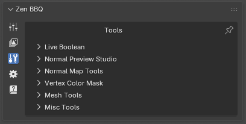 |
|:---:|
| *Fig. 1. Tools Panel.* |

---

## Live Boolean

| 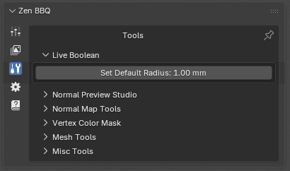 |
|:---:|
| *Fig. 2. Live Boolean operator.* |

| 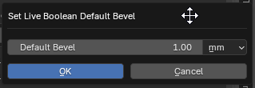 |
|:--:|
| *Fig. 3. Live Boolean operator properties invoke dialog.* |

* **Set Default Radius:** Specifies the fallback bevel radius that will automatically be assigned to any newly generated intersection edges created by Blender's non-destructive Boolean modifiers. This ensures that your procedural bevels remain seamless and present on newly cut geometry without manual reassignment.

---

## Normal Preview Studio

| 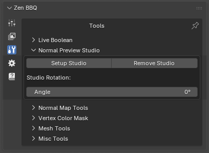 |
|:---:|
| *Fig. 4. Setup Studio panel.* |

This utility creates a classic three-point lighting rig paired with a camera and a target Empty to help you inspect shading, normal orientation, and procedural bevels under optimal lighting conditions.

| 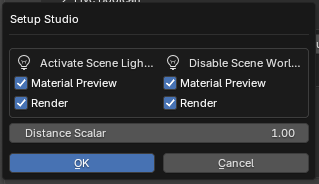 |
|:---:|
| *Fig. 5. Setup Studio invoke dialog options.* |

* **Setup Studio:** Opens an invoke dialog layout to customize the preview behavior:
    * **Activate Scene Lights:** Toggles Blender's viewport shading to use scene lights during *Material Preview* or *Render* modes.
    * **Disable Scene World:** Option to isolate your lighting environment by blocking default world backgrounds.
    * **Distance Scalar:** Scales the proportional distance of the lights relative to the asset.
* **Remove Studio:** Cleanly strips the generated lights, camera, and empty from the scene.

> ⚠️ **Important Note:** At least one object must be selected before clicking **Setup Studio**, as the lighting rig is automatically target-constrained and oriented toward the selected asset.
> 
> 💡 **Troubleshooting:** If the lights do not appear in the viewport after initialization, please check Blender's global **Selectability and Visibility** overlays. If Light objects are hidden there, Blender will not render them in the viewport—Zen BBQ does not forcefully override these global visibility toggles.

---

## Normal Map Tools

| 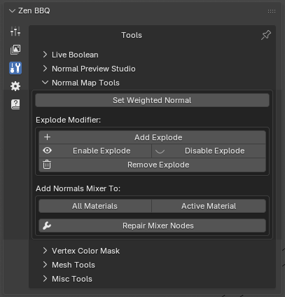 |
|:---:|
| *Fig. 6. Normal Maps tools panel.* |

A suite of utilities designed to fine-tune surface normals and prevent projection artifacts.

| 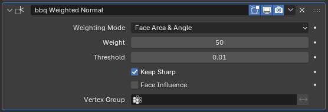 |
|:---:|
| *Fig. 7. Automatically configured bbq Weighted Normal modifier.* |

* **Set Weighted Normal:** A convenience operator that instantly injects a custom-configured `Weighted Normal` modifier (`bbq Weighted Normal`) into your object's modifier stack. It sets the Weighting Mode to *Face Area & Angle* and enables *Keep Sharp* to keep shading flat and clean on large surfaces.

#### BBQ Explode System

| 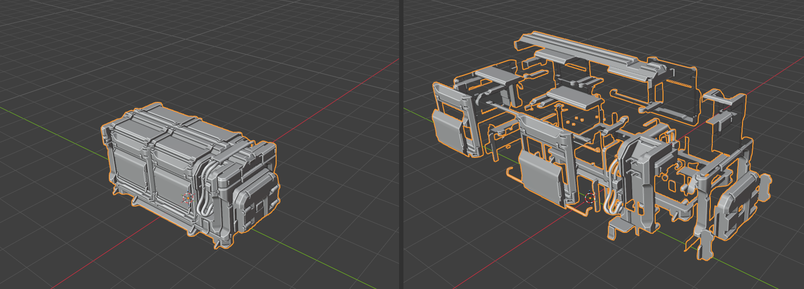 |
|:---:|
| *Fig. 8. Exploded object example.* |

Baking ambient occlusion or utilizing procedural bevel shaders on multi-part meshes can cause unwanted bleeding or projection artifacts where separate parts touch or intersect. The **Explode Modifier** handles this procedurally.

| 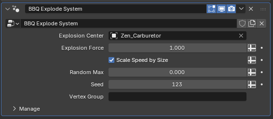 |
|:---:|
| *Fig. 9. BBQ Explode System settings in the modifier stack.* |

* **Add Explode:** Applies a procedural displacement setup to your object.
    * **Explosion Center:** By default, the object assigns itself as the center. For advanced control, **it is highly recommended to replace this with an Empty** or another external object. This allows you to easily move, rotate, or scale the Empty to direct how the mesh pieces separate in 3D space.
    * **Vertex Group:** If specified, only geometry within the designated group will disperse. If left blank, the system automatically explodes the asset based on contiguous **mesh parts (Loose Parts)**.
* **Enable / Disable / Remove Explode:** Quick management toggles to control or completely purge the explode modifier state.
  
#### Add Normals Mixer

The **Normals Mixer** allows you to combine procedural bevels with custom surface details (such as micro-texture details, noise, or baked structural normal maps simulating metal surfaces).

| 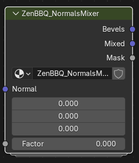 |
|:---:|
| *Fig. 10. Custom ZenBBQ_NormalsMixer node group structure.* |

* **All Materials / Active Material:** Instantly injects the custom `ZenBBQ_NormalsMixer` node group into either all materials of the selected mesh or only the active one.
* **Repair Mixer Nodes (Wrench icon):** A dedicated restoration operator. Because advanced users often customize the internal node structures inside the mixer group to achieve unique shading results, the addon avoids fully automating node repair. This standalone button ensures users can manually fix broken links or re-initialize default configurations without losing their internal node adjustments inadvertently.

##### Node In/Out Specifications:
* **Inputs:**
    * **Normal:** Receives external surface normal inputs (e.g., secondary details or textures).
    * **Factor:** Controls the blending blend state across the mesh surface.
* **Outputs:**
    * **Bevels:** Outputs perfectly clean, procedural bevel normals.
    * **Mixed:** Outputs a blended combination of the procedural bevels and the incoming data fed into the *Normal* input slot (driven by the *Factor* value).
    * **Mask:** Generates a black-and-white isolation mask mapped specifically to the calculated bevel areas for further material customization.

## Vertex Color Mask

| 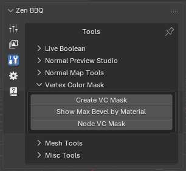 |
|:---:|
| *Fig. 11. Vertex Color Mask tools panel.* |

This suite of tools converts bevel radius parameters into Vertex Color attributes. This is essential for exporting procedural bevel data to external baking or rendering suites—most notably **Marmoset Toolbag**, which can interpret these vertex data channels to render identical procedural edges externally. For a detailed step-by-step workflow, check out our [Marmoset Toolbag Integration Guide](marmoset-integration.md).

---

### Create VC Mask

This operator bakes bevel width values directly into the static vertex colors of the selected mesh.

> ⚠️ **Modifier Stack Limitation:** Since this is a standard operator that generates static vertex color data, **it evaluates the base geometry only and does not account for active object modifiers**. Consequently, it cannot process non-destructive **Live Booleans**. To bake accurate vertex colors using this method, your modifier stack must be applied permanently. If you need to retain your live modifier stack, use the **Node VC Mask** alternative instead.

| 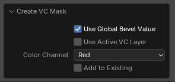 |
|:---:|
| *Fig. 12. Create VC Mask operator property options.* |

* **Layer Initialization (`G_ZenBBQ_VC_Mask`):** By default, the operator automatically initializes a new color layer named with a `G_` prefix (indicating *Generated* data). This new layer is created with standard properties: **Domain: Face Corner**, **Data Type: Color**.
* **Use Active VC Layer:** If you require a different domain/type layout or want to merge the generated mask into an existing vertex color set, make your target layer active in Blender and check this option.
* **Color Channel (Red / Green / Blue / Alpha / Combinations):** Directs the data into specific color channels according to the specifications of your destination software.
    * *Tip:* If you are unsure about channel layouts or are not using vertex colors to transmit other data types, selecting the final multi-channel profile (**Red, Green, Blue, Alpha**) is highly recommended. This prevents channel-bleeding export errors at the expense of a slightly larger file size.
* **Add to Existing:** When enabled, the operator overwrites *only* the specific channel assigned in the *Color Channel* field, protecting data sitting on the remaining channels from being wiped. *Note: Data within the active target channel is fully replaced, not blended.*

---

### Show Max Bevel by Material

Because vertex color channels operate strictly within a normalized float range of `0.0` to `1.0`, absolute real-world bevel values (e.g., 0mm to 8mm) must be mathematically remapped into this 0-1 scale. This operator scans your mesh to find the maximum bevel width present.

| 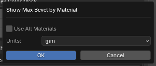 |
|:---:|
| *Fig. 13. Show Max Bevel by Material configuration dialog.* |

* **Use All Materials:** Expands the evaluation scan across every material assigned to the asset. If unchecked, it will analyze only the active material slot.
* **Units:** Select your preferred metric readout (e.g., Millimeters, Centimeters).

| 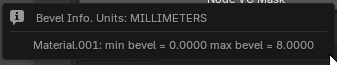 |
|:---:|
| *Fig. 14. Diagnostic pop-up window output log.* |

The resulting pop-up displays the measurement units, material names, and the exact minimum and maximum bevel ranges found (e.g., `Material.001: min bevel = 0.0000 max bevel = 8.0000`). Use this exact maximum value to accurately calibrate remapping scales or shader attributes in your destination shading application.

---

### Node VC Mask

This operator provides a **fully dynamic alternative** by applying a customized Geometry Nodes modifier to the selected object.

| 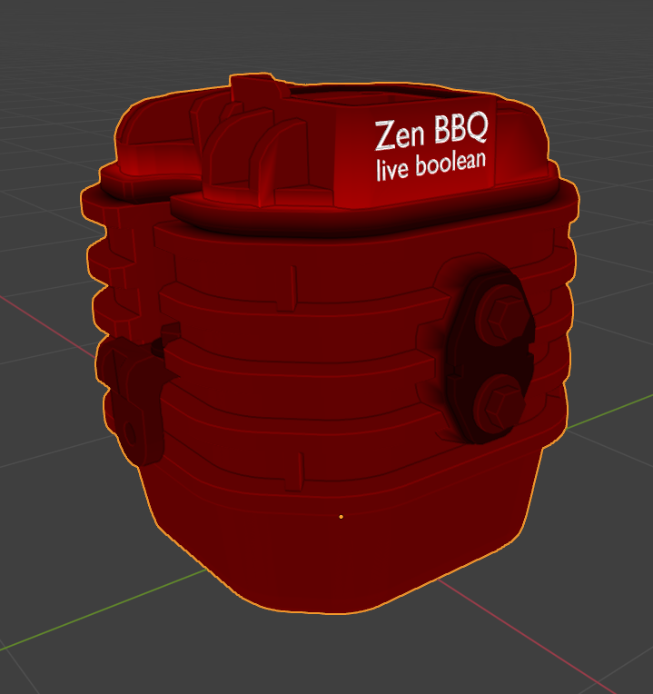 |
|:---:|
| *Fig. 15. Dynamic node-based vertex color overlay previewed in the viewport.* |

* **Dynamic Modifiers & Live Booleans:** Unlike the static baking tool, this dynamic system updates automatically when you alter underlying geometry or change bevel presets. Most importantly, **it fully supports Live Boolean operations** and respects the *Live Boolean default radius* set in your preferences.
    * *Best Practice:* To ensure all procedural cuts and intersections are tracked properly, ensure the generated modifier is placed **at the very bottom of your modifier stack**.

| 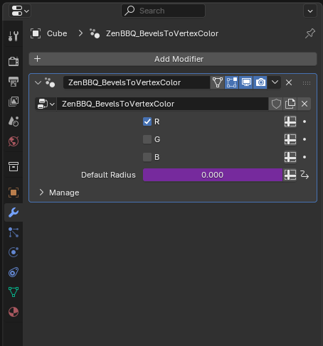 |
|:---:|
| *Fig. 16. ZenBBQ_BevelsToVertexColor modifier configuration settings.* |

* **Layer Initialization (`N_ZenBBQ_VC_Mask`):** Automatically initializes a dynamic node evaluation layer prefixed with `N_` (indicating *Nodes* data). 
    * *Note:* If you intend to copy this modifier manually across objects or chain it into your own custom node setups, you must create an attribute layer named `N_ZenBBQ_VC_Mask` manually on those target meshes.
* **Channel Toggles (R / G / B):** Isolates live mask generation to selected color channels directly from the modifier panel. You can select more than one channel simultaneously.
* **Alpha Channel Limitation:** Due to core limitations within Blender's Geometry Nodes engine, processing the Alpha channel attribute dynamically is currently impossible. If your external pipeline strictly requires data inside the Alpha channel, you must use the static **Create VC Mask** operator instead.
* **Default Radius Field:** This field inside the modifier UI is read-only and serves purely as an informational reference displaying the live preference-driven fallback radius.
  
## Mesh Tools

| 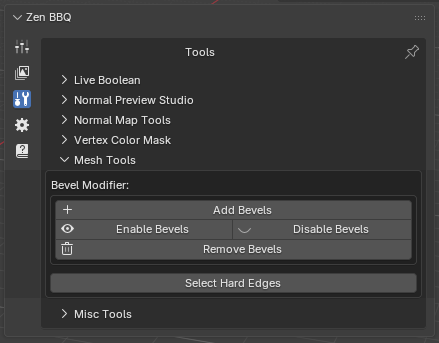 |
|:---:|
| *Fig. 17. Mesh Tools panel.* |

A collection of geometric utilities designed to bridge Zen BBQ data with Blender's native modeling stack and selection tools.

### Bevel Modifier

* **Add Bevels:** Automatically adds a pre-configured `BBQ Mesh Bevels` modifier to your stack. 
* **Enable / Disable / Remove Bevels:** Quick global switches to toggle or clear the modifier's influence.

| 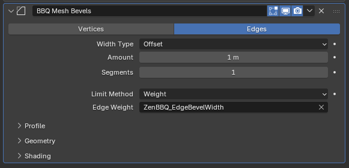 |
|:---:|
| *Fig. 18. BBQ Mesh Bevels modifier driving edge widths via custom attributes.* |

> 💡 **The Evolution of Bevel Attributes (Vertices vs Edges):**
> * **Historically (Pre-Zen BBQ 2.0):** The addon exclusively saved bevel data into **Vertex Attributes**. This architecture allows for non-uniform, variable-width bevels along a single continuous edge. For instance, increasing the weight on a specific corner vertex within a recess lets you simulate organic casting defects, metal wear, or varying thickness—a powerful artistic feature for realistic hard-surface modeling.
> * **Zen BBQ 2.0+ Update:** The addon now stores bevel values inside **Edge Attributes** as well. This enables Blender's native Bevel modifier to dynamically read custom edge data fields (such as `ZenBBQ_EdgeBevelWidth`) and scale widths accurately directly across geometric selections.

### Select Hard Edges

| 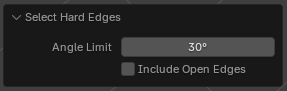 |
|:---:|
| *Fig. 19. Select Hard Edges operator properties.* |

* **Select Hard Edges:** Evaluates the mesh geometry and instantly selects sharp or hard edges to streamline hard-surface analysis and workflow preparation.
    * **Angle Limit:** Specifies the minimum geometric angle threshold (e.g., 30°) used to define which edges are considered sharp.
    * **Include Open Edges:** When enabled, automatically includes boundary and non-manifold open mesh edges into the final selection.

---

## Misc Tools

| 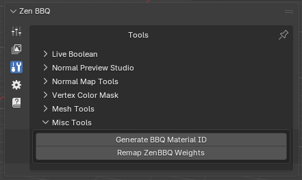 |
|:---:|
| *Fig. 20. Misc Tools panel.* |

### Remap ZenBBQ Weights

Legacy versions of Blender could not read custom attributes within the Bevel modifier, meaning edge/vertex weights were strictly capped inside a fixed `0.0` to `1.0` range. This utility serves as a backward-compatibility and data-transfer bridge.

| 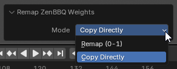 |
|:---:|
| *Fig. 21. Mode options for remapping vertex and edge attributes.* |

* **Remap (0-1):** Compresses and maps your absolute real-world bevel metrics into a normalized `0-1` weight value, ensuring compatibility with older Blender tools or external setups that rely strictly on legacy weight layers.
* **Copy Directly:** Clones existing Zen BBQ custom attribute data directly into Blender's standard edge-weight layers without applying normalization changes.

### Generate BBQ Material ID

This operator provides quick local access to the Material ID assignment tool. It functions identically to the utility fully detailed in the [Baking Material IDs](subpanel_bake.md#4-material-id) pipeline section, assigning unique distinct color profiles across material groups for seamless color ID generation.

---

[ **Gumroad**](https://sergeytyapkin.gumroad.com/l/zenbbq) | [ **Superhive**](https://blendermarket.com/products/zen-bbq) | [ **Discord**](https://discord.gg/wGpFeME)